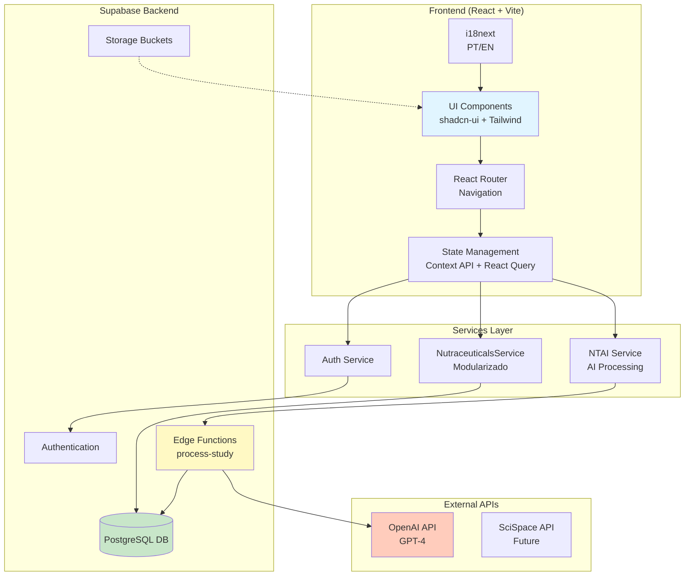
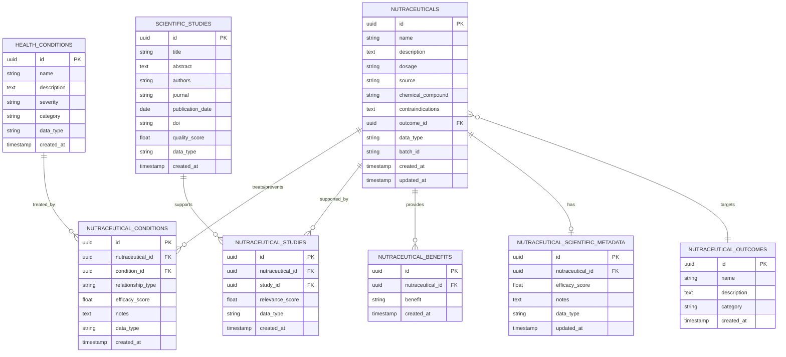
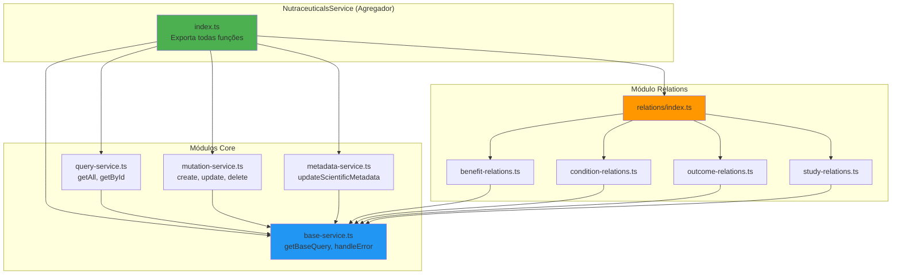
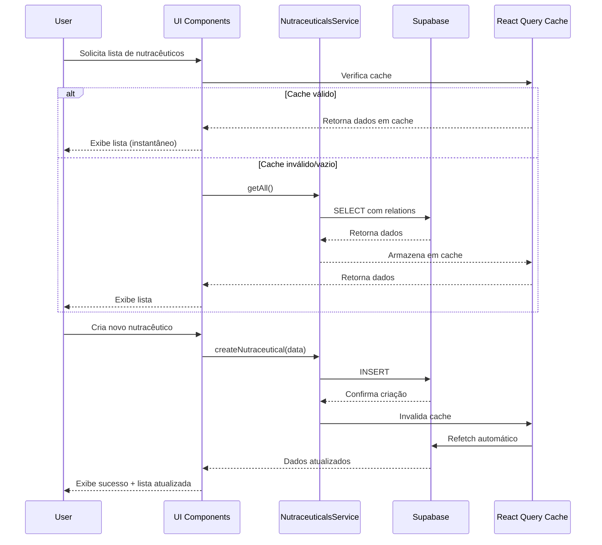
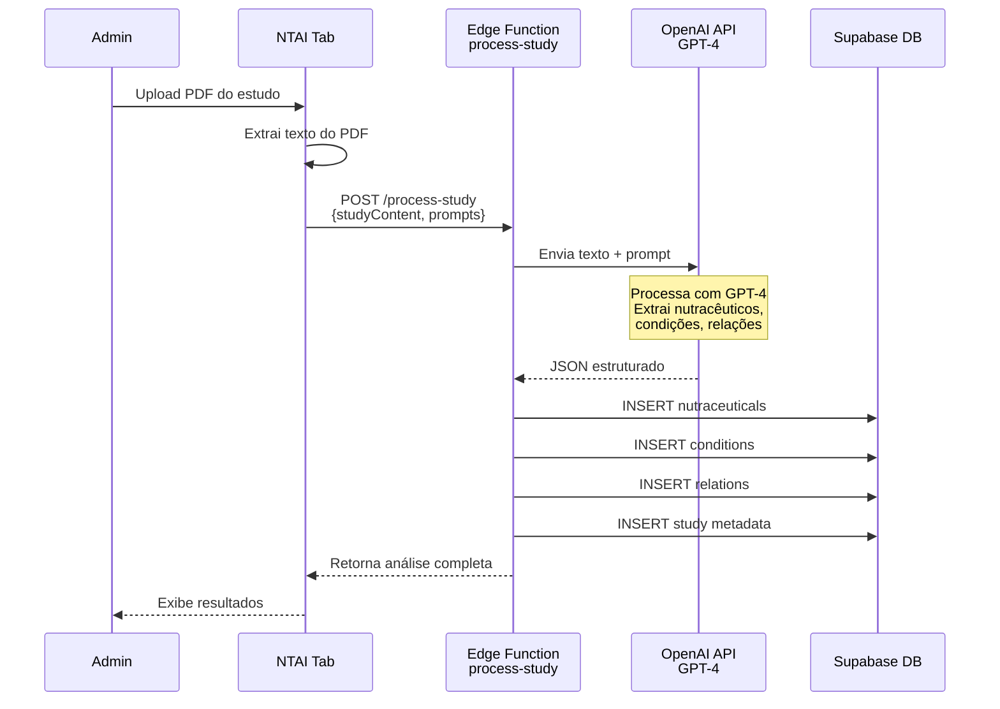

# 🏗️ NutraTherapy - Arquitetura Técnica Completa

## 📋 Índice

1. [Visão Geral do Sistema](#visão-geral-do-sistema)
2. [Arquitetura Técnica](#arquitetura-técnica)
3. [Modelo de Dados](#modelo-de-dados)
4. [Estrutura de Navegação](#estrutura-de-navegação)
5. [Serviços e Padrões](#serviços-e-padrões)
6. [Configurações Importantes](#configurações-importantes)
7. [Sistema de Design](#sistema-de-design)

---

## 🎯 Visão Geral do Sistema

### Conceito de Negócio

**NutraTherapy** é um sistema inteligente de recomendação de nutracêuticos para pets que visa:

- **Complementar deficiências nutricionais** nas rações comerciais, ajustando-as aos níveis ótimos recomendados por organizações veterinárias
- **Prevenir doenças degenerativas** com base na raça, exames, histórico clínico e opinião veterinária
- **Promover longevidade saudável** através de estratégias nutracêuticas personalizadas

### Proposta de Valor

O sistema combina:
- 🔬 **Base científica**: Estudos peer-reviewed e evidências clínicas
- 🤖 **Inteligência Artificial**: Processamento NTAI para análise de estudos
- 📊 **Visualizações avançadas**: Grafos, matrizes, Sankey diagrams
- 🌍 **Bilinguismo**: PT/EN nativo em toda interface

### Público-Alvo (Personas)

#### 👤 **TUTOR (Dono do Pet)**
- **Necessidades**: Entender recomendações de forma simples, visualizar composição e posologia, aprovar e acompanhar planos
- **Fluxo**: Recebe explicações → Aprova plano anual → Recebe kit nutracêutico → Acompanha evolução
- **Interface**: Focada em simplicidade e clareza

#### 🩺 **VETERINÁRIO**
- **Necessidades**: Gerenciar dados clínicos, consultar IA, visualizar estudos científicos, compreender recomendações
- **Fluxo**: Carrega dados do pet → Consulta IA → Visualiza evidências científicas → Analisa planos
- **Interface**: Dashboard detalhado com gráficos interativos e recursos para conversação com IA

#### ⚙️ **ADMINISTRADOR**
- **Necessidades**: Gerenciar banco de dados de nutracêuticos, prompts da IA, correlações clínicas
- **Fluxo**: Administra catálogo → Configura correlações → Atualiza estudos → Monitora eficiência
- **Interface**: Painéis administrativos para configuração de sistema

---

## 🔧 Arquitetura Técnica

### Stack Tecnológico Completo

#### **Frontend**
- **React** 18.3.1 - UI Library
- **TypeScript** 5.5.3 - Type safety
- **Vite** 5.4.1 - Build tool & dev server
- **React Router DOM** 6.26.2 - Routing
- **React Query** (@tanstack/react-query) 5.56.2 - Data fetching & caching

#### **UI & Design**
- **Tailwind CSS** 3.4.1 - Utility-first styling
- **shadcn-ui** - Component library (Radix UI primitives)
- **Framer Motion** 12.23.12 - Animations
- **Lucide React** 0.462.0 - Icons

#### **Visualizações**
- **Recharts** 2.12.7 - Charts & graphs
- **@nivo/bar** 0.84.0 - Advanced bar charts
- **vis-network** 9.1.9 - Graph visualizations
- **vis-data** 7.1.9 - Data structures for vis

#### **Backend & Database**
- **Supabase** 2.49.4 - BaaS (Auth, DB, Storage, Edge Functions)
- **PostgreSQL** - Database (via Supabase)
- **Edge Functions** - Serverless compute (Deno runtime)

#### **Internacionalização**
- **i18next** 25.2.0 - i18n framework
- **react-i18next** 15.4.1 - React bindings
- **i18next-browser-languagedetector** 8.0.4 - Language detection

#### **Formulários & Validação**
- **react-hook-form** 7.53.0 - Form management
- **zod** 3.23.8 - Schema validation
- **@hookform/resolvers** 3.9.0 - Zod integration

#### **Utilitários**
- **date-fns** 3.6.0 - Date manipulation
- **uuid** 11.1.0 - UUID generation
- **clsx** & **tailwind-merge** - Class name utilities

### Diagrama de Arquitetura Geral



### Estrutura de Pastas

```
src/
├── components/
│   ├── administrador/          # Componentes do admin
│   │   ├── visualizations/     # Visualizações (grafos, matrizes, sankey)
│   │   ├── tabs/               # 27 tabs do administrador
│   │   └── ...
│   ├── ui/                     # shadcn-ui components
│   └── ...
├── contexts/                   # React Contexts
│   └── NutraceuticalContext.tsx
├── services/                   # Business logic
│   ├── nutraceuticals/         # Serviço modularizado
│   │   ├── base-service.ts
│   │   ├── query-service.ts
│   │   ├── mutation-service.ts
│   │   ├── metadata-service.ts
│   │   └── relations/          # Submódulos de relações
│   ├── ntai/                   # NTAI AI services
│   └── ...
├── config/                     # Configurações
│   └── admin-tabs.ts           # 27 tabs definition
├── integrations/
│   └── supabase/               # Supabase client & types
├── locales/                    # Traduções PT/EN
│   ├── pt/translation.json
│   └── en/translation.json
├── types/                      # TypeScript types
├── utils/                      # Utility functions
├── pages/                      # Route pages
└── i18n.ts                     # i18n config
```

### Padrões de Código

#### **Convenções de Nomenclatura**
- **Componentes**: PascalCase (`NutraceuticalCard.tsx`)
- **Hooks**: camelCase com prefixo `use` (`useNutraceuticals.ts`)
- **Services**: PascalCase com sufixo `Service` (`NutraceuticalsService`)
- **Types**: PascalCase (`NutraceuticalWithRelations`)
- **Utils**: camelCase (`convertLinksToNumericIndices`)

#### **Organização de Imports**
```typescript
// 1. External libraries
import { useState } from 'react';
import { useQuery } from '@tanstack/react-query';

// 2. Internal absolute imports (@/)
import { NutraceuticalsService } from '@/services/nutraceuticals';
import { Button } from '@/components/ui/button';

// 3. Relative imports
import { NutraceuticalCard } from './NutraceuticalCard';
```

#### **Padrão de Serviços**
```typescript
// Serviço modular com funções específicas
export const ExampleService = {
  async getAll() { /* ... */ },
  async getById(id: string) { /* ... */ },
  async create(data: CreateData) { /* ... */ },
  handleError(error: any, operation: string) { /* ... */ }
};
```

---

## 🗄️ Modelo de Dados

### Entidades Principais

O sistema é centrado em **4 entidades principais**:

1. **NUTRACEUTICALS** - Nutracêuticos individuais (NMN, Resveratrol, Curcumina, etc.)
2. **HEALTH_CONDITIONS** - Condições de saúde/doenças (Artrite, Declínio Cognitivo, etc.)
3. **SCIENTIFIC_STUDIES** - Estudos científicos peer-reviewed
4. **NUTRACEUTICAL_OUTCOMES** - Objetivos/outcomes esperados (Longevidade, Anti-inflamatório, etc.)

### Diagrama ER (Entity-Relationship)



### Tabelas Supabase (Descrição Detalhada)

#### **nutraceuticals**
Armazena nutracêuticos individuais (substâncias naturais simples).

| Campo | Tipo | Descrição |
|-------|------|-----------|
| `id` | uuid | Chave primária |
| `name` | varchar | Nome do nutracêutico (ex: "NMN", "Resveratrol") |
| `description` | text | Descrição detalhada |
| `dosage` | varchar | Dosagem recomendada |
| `source` | varchar | Fonte/origem do composto |
| `chemical_compound` | varchar | Fórmula química |
| `contraindications` | text | Contraindicações conhecidas |
| `outcome_id` | uuid | FK para `nutraceutical_outcomes` |
| `data_type` | varchar | "seed", "mock", "production" |
| `batch_id` | varchar | ID do lote de importação |

#### **health_conditions**
Condições de saúde que podem ser tratadas/prevenidas.

| Campo | Tipo | Descrição |
|-------|------|-----------|
| `id` | uuid | Chave primária |
| `name` | varchar | Nome da condição |
| `description` | text | Descrição clínica |
| `severity` | varchar | Nível de severidade |
| `category` | varchar | Categoria (ex: "Degenerativa", "Inflamatória") |

#### **scientific_studies**
Estudos científicos peer-reviewed.

| Campo | Tipo | Descrição |
|-------|------|-----------|
| `id` | uuid | Chave primária |
| `title` | varchar | Título do estudo |
| `abstract` | text | Resumo/abstract |
| `authors` | varchar | Autores |
| `journal` | varchar | Revista científica |
| `publication_date` | date | Data de publicação |
| `doi` | varchar | DOI do estudo |
| `quality_score` | float | Score de qualidade (0-5) |

#### **nutraceutical_conditions** (Tabela de Relação)
Relaciona nutracêuticos com condições de saúde.

| Campo | Tipo | Descrição |
|-------|------|-----------|
| `id` | uuid | Chave primária |
| `nutraceutical_id` | uuid | FK para nutracêuticos |
| `condition_id` | uuid | FK para condições |
| `relationship_type` | varchar | "treats", "prevents", "mitigates" |
| `efficacy_score` | float | Score de eficácia (0-5) |
| `notes` | text | Observações |

#### **nutraceutical_studies** (Tabela de Relação)
Relaciona nutracêuticos com estudos científicos.

| Campo | Tipo | Descrição |
|-------|------|-----------|
| `nutraceutical_id` | uuid | FK para nutracêuticos |
| `study_id` | uuid | FK para estudos |
| `relevance_score` | float | Score de relevância (0-5) |

---

## 🧭 Estrutura de Navegação

### 27 Tabs do Administrador

As tabs são organizadas em **5 grupos principais**, definidas em `src/config/admin-tabs.ts`:

```mermaid
graph TB
    Admin[Administrador]
    
    Admin --> KB[Knowledge Base<br/>7 tabs]
    Admin --> DP[Data Processing<br/>7 tabs]
    Admin --> RD[Research R&D<br/>6 tabs]
    Admin --> PA[Predictive Analysis<br/>3 tabs]
    Admin --> CF[Configuration<br/>4 tabs]
    
    KB --> KB1[Nutraceuticals]
    KB --> KB2[Health Conditions]
    KB --> KB3[Scientific Studies]
    KB --> KB4[Outcomes]
    KB --> KB5[Outcomes Management]
    KB --> KB6[Relations]
    KB --> KB7[SciSpace Manager]
    
    DP --> DP1[NTAI Processing]
    DP --> DP2[Study Scoring]
    DP --> DP3[Data Import]
    DP --> DP4[Mock Data Generator]
    DP --> DP5[Efficacy Matrix Editor]
    DP --> DP6[Study Parser]
    DP --> DP7[Processing Queue]
    
    RD --> RD1[Studies in Progress ⭐⭐]
    RD --> RD2[Correlations Discovery]
    RD --> RD3[Hypothesis Lab]
    RD --> RD4[Clinical Validations]
    RD --> RD5[Research Timeline]
    RD --> RD6[Conflict Detector]
    
    PA --> PA1[Predictive Models ⭐⭐⭐]
    PA --> PA2[Combinatorial Optimizer]
    PA --> PA3[Personalization Engine]
    
    CF --> CF1[AI Prompts]
    CF --> CF2[System Config]
    CF --> CF3[Evidence Standards]
    CF --> CF4[Design System]
    
    style PA1 fill:#ffd700,stroke:#ff6b6b,stroke-width:3px
    style RD1 fill:#ffeb99,stroke:#ff6b6b,stroke-width:2px
    style KB6 fill:#fff9c4,stroke:#ff9800,stroke-width:1px
```



### Grupos Detalhados

#### 📚 **Knowledge Base** (7 tabs)
Base de conhecimento científico do sistema.

1. **Nutraceuticals** - CRUD de nutracêuticos
2. **Health Conditions** - Gerenciamento de condições
3. **Scientific Studies** - Biblioteca de estudos
4. **Outcomes** - Objetivos terapêuticos
5. **Outcomes Management** - Gestão avançada de outcomes
6. **Relations** - Visualização de relacionamentos (grafos) ⭐
7. **SciSpace Manager** - Integração futura com SciSpace

#### ⚙️ **Data Processing** (7 tabs)
Processamento e importação de dados.

1. **NTAI Processing** - Interface NTAI (mockup)
2. **Study Scoring** - Pontuação de estudos
3. **Data Import** - Importação em lote
4. **Mock Data Generator** - Gerador de dados de exemplo
5. **Efficacy Matrix Editor** - Editor de matriz de eficácia
6. **Study Parser** - Parser de estudos PDF
7. **Processing Queue** - Fila de processamento

#### 🔬 **Research (R&D)** (6 tabs)
Ferramentas de pesquisa e desenvolvimento.

1. **Studies in Progress** - Estudos longitudinais ⭐⭐
2. **Correlations Discovery** - Descoberta de correlações
3. **Hypothesis Lab** - Laboratório de hipóteses
4. **Clinical Validations** - Validações clínicas
5. **Research Timeline** - Timeline de pesquisas
6. **Conflict Detector** - Detector de conflitos

#### 📊 **Predictive Analysis** (3 tabs)
Modelos preditivos e otimização.

1. **Predictive Models** - Modelos preditivos ⭐⭐⭐ (TOP PRIORITY)
2. **Combinatorial Optimizer** - Otimizador combinatorial
3. **Personalization Engine** - Motor de personalização

#### ⚙️ **Configuration** (4 tabs)
Configurações do sistema.

1. **AI Prompts** - Gerenciamento de prompts
2. **System Config** - Configurações gerais
3. **Evidence Standards** - Padrões de evidência
4. **Design System** - Sistema de design

### Prioridade para Stanford Demo

- **⭐⭐⭐ PRIORIDADE MÁXIMA**: Predictive Models
- **⭐⭐ ALTA**: Studies in Progress
- **⭐ MÉDIA**: Relations

---

## 🔌 Serviços e Padrões

### NutraceuticalsService (Modularizado)

O serviço foi **refatorado em módulos especializados** para melhor manutenibilidade:

```
src/services/nutraceuticals/
├── index.ts                    # Agregador principal
├── base-service.ts             # Queries base + error handling
├── query-service.ts            # Consultas (getAll, getById)
├── mutation-service.ts         # Mutações (create, update, delete)
├── metadata-service.ts         # Metadados científicos
└── relations/                  # Submódulo de relações
    ├── index.ts
    ├── benefit-relations.ts
    ├── condition-relations.ts
    ├── outcome-relations.ts
    └── study-relations.ts
```

#### **Diagrama de Serviços**



#### **Exemplo de Uso**

```typescript
import { NutraceuticalsService } from '@/services/nutraceuticals';

// Query
const all = await NutraceuticalsService.getAll();
const one = await NutraceuticalsService.getById(id);

// Mutation
await NutraceuticalsService.createNutraceutical({ name, description, ... });
await NutraceuticalsService.updateNutraceutical(id, updates);
await NutraceuticalsService.deleteNutraceutical(id);

// Relations
await NutraceuticalsService.relateToCondition(nutId, condId, 'treats', 4.5);
await NutraceuticalsService.addBenefit(nutId, 'Anti-inflamatório');
await NutraceuticalsService.relateToStudy(nutId, studyId, 4.0);
```

### Context API (NutraceuticalContext)

**Centraliza o estado** de nutracêuticos na aplicação:

```typescript
// src/contexts/NutraceuticalContext.tsx
export const NutraceuticalProvider = ({ children }) => {
  const [selectedNutraceutical, setSelectedNutraceutical] = useState(null);
  // ... outros estados
};

// Uso em componentes
const { selectedNutraceutical, setSelectedNutraceutical } = useNutraceuticalContext();
```

### React Query Patterns

**Padrão de queries** usado em toda aplicação:

```typescript
const { data, isLoading, error, refetch } = useQuery({
  queryKey: ['nutraceuticals'],
  queryFn: NutraceuticalsService.getAll,
  staleTime: 5 * 60 * 1000, // 5 minutos
});
```

**Padrão de mutations**:

```typescript
const mutation = useMutation({
  mutationFn: NutraceuticalsService.createNutraceutical,
  onSuccess: () => {
    queryClient.invalidateQueries({ queryKey: ['nutraceuticals'] });
    toast.success('Criado com sucesso');
  },
});
```

---

## ⚙️ Configurações Importantes

### supabase/config.toml

Configuração do projeto Supabase local:

```toml
project_id = "your-project-id"

[api]
enabled = true
port = 54321
max_rows = 1000

[db]
port = 54322
shadow_port = 54320
major_version = 15

[studio]
enabled = true
port = 54323
```

### admin-tabs.ts

**27 tabs** organizadas por grupo, com lazy loading:

```typescript
interface AdminTabConfig {
  id: string;
  label: string;
  group: 'knowledge-base' | 'data-processing' | 'research' | 'predictive-analysis' | 'configuration';
  icon: LucideIcon;
  component: LazyExoticComponent<ComponentType<any>>;
  description: string;
  permissions?: string[];
}

export const adminTabsConfig: AdminTabConfig[] = [
  {
    id: 'nutraceuticals',
    label: 'Nutraceuticals',
    group: 'knowledge-base',
    icon: Pill,
    component: lazy(() => import('@/components/administrador/tabs/NutraceuticalsTab')),
    description: 'Manage nutraceuticals database',
  },
  // ... 26 more
];
```

### i18n (Bilíngue PT/EN)

Sistema de tradução **obrigatório** em toda interface:

```typescript
// src/i18n.ts
i18n
  .use(LanguageDetector)
  .use(initReactI18next)
  .init({
    resources: {
      en: { translation: enTranslation },
      pt: { translation: ptTranslation },
    },
    fallbackLng: 'pt',
  });
```

**Uso em componentes:**

```typescript
const { t } = useTranslation();

return <Button>{t('buttons.save')}</Button>;
```

**Estrutura de traduções:**

```json
// src/locales/pt/translation.json
{
  "buttons": {
    "save": "Salvar",
    "cancel": "Cancelar"
  },
  "nutraceuticals": {
    "title": "Nutracêuticos",
    "create": "Criar Novo"
  }
}
```

---

## 🎨 Sistema de Design

### Princípios Visuais

1. **Clean e Minimalista** - Design inspirado no Google
2. **Elementos Finos e Elegantes** - Predominantemente em preto
3. **Paleta Pastel Diferenciada** - Não apenas tons da mesma cor
4. **Tipografia Clara** - Legível em todas as interfaces
5. **Gráficos Funcionais** - Informativos, não apenas decorativos

### Design System (Tailwind + CSS Variables)

**CRITICAL**: Todas as cores usam **semantic tokens** definidos em `src/index.css`:

```css
:root {
  /* Base colors */
  --background: 0 0% 100%;
  --foreground: 222.2 84% 4.9%;
  
  /* Primary brand color */
  --primary: 222.2 47.4% 11.2%;
  --primary-foreground: 210 40% 98%;
  
  /* Secondary */
  --secondary: 210 40% 96.1%;
  --secondary-foreground: 222.2 47.4% 11.2%;
  
  /* Muted */
  --muted: 210 40% 96.1%;
  --muted-foreground: 215.4 16.3% 46.9%;
  
  /* Accent */
  --accent: 210 40% 96.1%;
  --accent-foreground: 222.2 47.4% 11.2%;
  
  /* ... outros tokens */
}
```

**Uso correto em componentes:**

```tsx
// ❌ ERRADO - Cores hardcoded
<div className="bg-white text-black border-gray-200">

// ✅ CORRETO - Semantic tokens
<div className="bg-background text-foreground border-border">
```

### Componentes Reutilizáveis (shadcn-ui)

Todos os componentes UI são **customizados** a partir do shadcn-ui:

```
src/components/ui/
├── button.tsx          # Variantes: default, destructive, outline, secondary, ghost, link
├── card.tsx            # Card, CardHeader, CardTitle, CardDescription, CardContent
├── dialog.tsx          # Modal dialogs
├── form.tsx            # Form components com react-hook-form
├── table.tsx           # Table components
├── tabs.tsx            # Tab navigation
├── toast.tsx           # Toast notifications (Sonner)
└── ... (50+ componentes)
```

### Variantes de Botões (Exemplo)

```typescript
// src/components/ui/button.tsx
const buttonVariants = cva(
  "inline-flex items-center justify-center transition-colors",
  {
    variants: {
      variant: {
        default: "bg-primary text-primary-foreground hover:bg-primary/90",
        destructive: "bg-destructive text-destructive-foreground hover:bg-destructive/90",
        outline: "border border-input hover:bg-accent hover:text-accent-foreground",
        secondary: "bg-secondary text-secondary-foreground hover:bg-secondary/80",
        ghost: "hover:bg-accent hover:text-accent-foreground",
        link: "text-primary underline-offset-4 hover:underline",
      },
      size: {
        default: "h-10 px-4 py-2",
        sm: "h-9 px-3",
        lg: "h-11 px-8",
        icon: "h-10 w-10",
      },
    },
  }
);
```

### Paleta de Cores (HSL)

Todas as cores devem ser em **formato HSL** para suportar dark mode:

```css
/* Light mode */
:root {
  --primary: 222.2 47.4% 11.2%;  /* hsl(222.2, 47.4%, 11.2%) */
}

/* Dark mode */
.dark {
  --primary: 210 40% 98%;  /* hsl(210, 40%, 98%) */
}
```

---

## 📊 Fluxo de Dados



---

## 🔬 NTAI Processing Flow (Edge Function)



---

## 🎯 Conclusão

Esta arquitetura foi projetada para:

- ✅ **Escalabilidade** - Serviços modulares, React Query, Supabase
- ✅ **Manutenibilidade** - Código organizado, tipos TypeScript, padrões consistentes
- ✅ **Performance** - Lazy loading, caching inteligente, otimizações
- ✅ **Internacionalização** - Sistema bilíngue nativo
- ✅ **Experiência do Usuário** - Design system consistente, visualizações ricas
- ✅ **Base Científica** - Integração com estudos, IA para processamento

Para mais detalhes sobre o **estado atual do projeto** e **plano para Stanford**, consulte:
- [CURRENT_STATE.md](./docs/CURRENT_STATE.md)
- [STANFORD_DEMO.md](./docs/STANFORD_DEMO.md)
