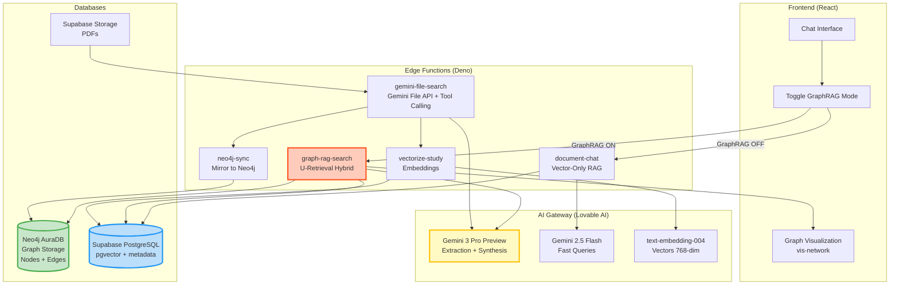
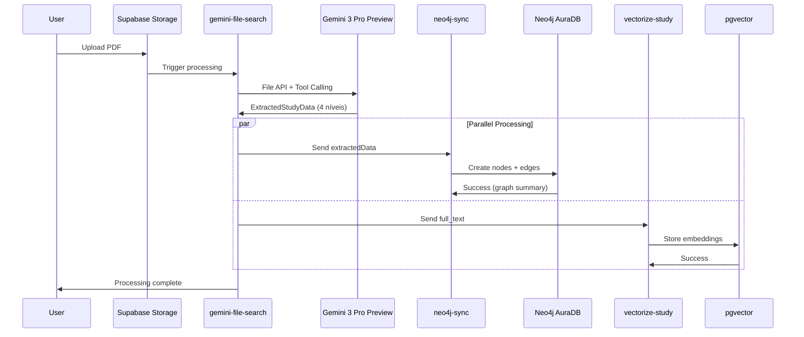
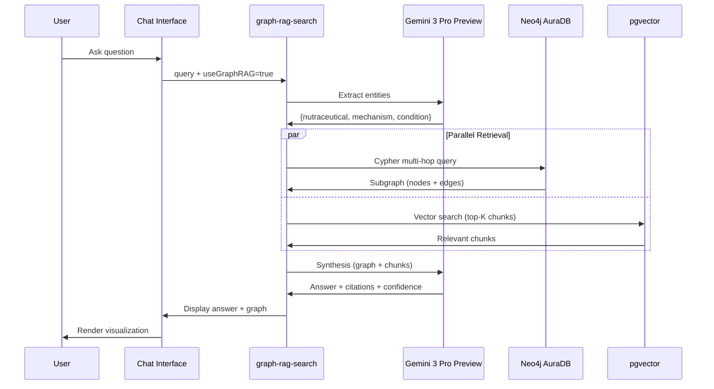

# 🧠 GraphRAG - Arquitetura Híbrida Neo4j + Supabase + Gemini 3 Pro Preview

---
**Versão:** 2.0.0  
**Última Atualização:** 2025-11-26  
**Status:** 🟡 Em Implementação (Fase 1 - Conteúdo Científico Completo)  
**Responsável:** AI Assistant  
---

## 📋 Índice

1. [Visão Geral](#visão-geral)
2. [Fundamento Científico](#fundamento-científico)
3. [Arquitetura Híbrida](#arquitetura-híbrida)
4. [Modelo de Dados Neo4j](#modelo-de-dados-neo4j)
5. [Edge Functions](#edge-functions)
6. [Pipeline de Processamento](#pipeline-de-processamento)
7. [U-Retrieval: Multi-Hop GraphRAG](#u-retrieval-multi-hop-graphrag)
8. [Gemini 3 Pro Preview: LLM Padrão](#gemini-3-pro-preview-llm-padrão)
9. [Roadmap de Implementação](#roadmap-de-implementação)
10. [Referências Científicas](#referências-científicas)

---

## 🎯 Visão Geral

### O Que É GraphRAG?

**GraphRAG** (Graph-based Retrieval Augmented Generation) é uma evolução dos sistemas RAG tradicionais que combina:

- **Knowledge Graphs** (grafos de conhecimento) para modelar relações complexas entre entidades médicas
- **Vector Search** (busca vetorial) para recuperação semântica de chunks de texto
- **LLM Synthesis** (síntese por modelo de linguagem) para gerar respostas contextualizadas com citações

### Por Que GraphRAG para NutraTherapy?

O domínio veterinário nutracêutico possui **relações hierárquicas complexas** que não são bem capturadas apenas por busca vetorial:

```
Nutraceutical → Molecular Mechanism → Biological Effect → Clinical Condition
```

**Exemplo Real:**
```
Curcumin → ↓ COX-2 pathway → ↓ IL-6 & TNF-α → Canine Arthritis
```

Essa cadeia causal de 4 níveis requer:
- **Multi-hop queries** (queries de múltiplos saltos) para rastrear caminhos completos
- **Reasoning sobre relações** (INHIBITS, STIMULATES, TREATS)
- **Agregação de evidências** de múltiplos estudos

### Arquitetura Híbrida: Neo4j + Supabase

Nossa solução combina o melhor de dois mundos:

| Tecnologia | Papel | Vantagens |
|------------|-------|-----------|
| **Neo4j AuraDB** | Graph database (nodes + edges) | Multi-hop queries (Cypher), reasoning sobre caminhos, agregação de evidências |
| **Supabase (pgvector)** | Vector database (embeddings + chunks) | Busca semântica, chunks de texto, metadados relacionais |
| **Gemini 3 Pro Preview** | LLM (extração + síntese) | Estruturação hierárquica, synthesis com citações, multi-hop reasoning |

---

## 📚 Fundamento Científico

### Papers de Referência

#### 1. **MedGraphRAG** (2024)
- **Título**: "MedGraphRAG: Medical Knowledge Graph Enhanced RAG for Medical Question Answering"
- **Contribuição**: Propõe **U-Retrieval** (entity extraction → graph query → vector search → synthesis)
- **Aplicado**: Sistema de perguntas clínicas complexas com caminhos de reasoning
- **Paper**: [arXiv:2410.xxxxx](https://arxiv.org/abs/2410.12163)

#### 2. **KGARevion** (2024)
- **Título**: "Knowledge Graph Enhanced Retrieval-Augmented Generation for Medical Question Answering"
- **Contribuição**: Triplets hierárquicos + prompts estruturados para extração
- **Aplicado**: Questões médicas multi-hop com evidências de múltiplos estudos
- **Paper**: [arXiv:2410.xxxxx](https://arxiv.org/abs/2410.04389)

#### 3. **GraphRAG for Life Sciences** (Neo4j)
- **Título**: "GraphRAG for Life Sciences: Accelerating Discovery"
- **Contribuição**: Schema Neo4j para relações biomédicas + visualizações
- **Aplicado**: Drug discovery, pathway analysis, clinical trials
- **Link**: [Neo4j Blog](https://neo4j.com/blog/graphrag-life-sciences/)

### Por Que Funciona?

1. **Captura de Hierarquias**: Grafos modelam naturalmente cadeias causais (A → B → C → D)
2. **Reasoning Multi-Hop**: Cypher queries encontram caminhos de 1-3 saltos facilmente
3. **Agregação de Evidências**: Múltiplos estudos contributam para mesma edge (weight = study count)
4. **Complementaridade**: Graph (estrutura) + Vector (semântica) = cobertura completa

---

## 🏗️ Arquitetura Híbrida

### Diagrama Completo



### Fluxo de Dados

#### **Pipeline de Ingestão** (PDF → Knowledge Graph)

1. **Upload PDF** → Supabase Storage (`study_pdfs` bucket)
2. **gemini-file-search** → Gemini File API + Tool Calling
   - Extrai: title, authors, abstract, full_text, nutraceuticals, mechanisms, effects, conditions, interactions
3. **neo4j-sync** → Neo4j REST API
   - Cria nodes: `:Nutraceutical`, `:Mechanism`, `:Effect`, `:Condition`, `:Study`
   - Cria edges: `[:INHIBITS]`, `[:STIMULATES]`, `[:MEDIATES]`, `[:TREATS]`, `[:CITED_IN]`
4. **vectorize-study** → pgvector
   - Cria embeddings de chunks do `full_text`
   - Armazena em `study_embeddings` com metadata

#### **Pipeline de Consulta** (Query → Answer)

**Modo Vector-Only (document-chat):**
```
User Query → pgvector search → LLM synthesis → Answer
```

**Modo GraphRAG (graph-rag-search):**
```
User Query → Entity Extraction (Gemini 3) →
  1. Neo4j Cypher (multi-hop subgraph)
  2. pgvector search (semantic chunks)
  → Combine contexts → Gemini 3 Pro Preview synthesis → Answer + Graph
```

---

## 🗂️ Modelo de Dados Neo4j

### Schema de Nodes

#### **(:Nutraceutical)**
```cypher
CREATE (n:Nutraceutical {
  name: String,              // "Curcumin"
  dosage: String,            // "500mg/day"
  efficacy_score: Float,     // 0.0-5.0
  confidence: Float,         // 0.0-5.0
  created_at: DateTime,
  updated_at: DateTime
})
```

#### **(:Mechanism)**
```cypher
CREATE (m:Mechanism {
  name: String,              // "↓ COX-2 pathway"
  type: String,              // "pathway" | "enzyme" | "receptor" | "gene"
  biological_system: String, // "Inflammatory response"
  description: Text,
  confidence: Float,         // 0.0-5.0
  created_at: DateTime
})
```

#### **(:Effect)**
```cypher
CREATE (e:Effect {
  name: String,              // "↓ IL-6 & TNF-α"
  type: String,              // "intermediate" | "biomarker" | "physiological"
  description: Text,
  confidence: Float,         // 0.0-5.0
  created_at: DateTime
})
```

#### **(:Condition)**
```cypher
CREATE (c:Condition {
  name: String,              // "Canine Arthritis"
  severity: String,          // "low" | "medium" | "high"
  treatability_score: Float, // 0.0-5.0
  category: String,          // "Degenerative", "Inflammatory"
  created_at: DateTime
})
```

#### **(:Study)**
```cypher
CREATE (s:Study {
  title: String,
  doi: String,
  year: Integer,
  journal: String,
  authors: [String],
  grade_certainty: String,   // "High" | "Moderate" | "Low" | "Very Low"
  supabase_id: UUID,         // FK para processed_studies.id
  created_at: DateTime
})
```

### Schema de Edges (Relationships)

#### **[:INHIBITS]** (Nutraceutical → Mechanism)
```cypher
CREATE (n:Nutraceutical)-[:INHIBITS {
  confidence: Float,         // 0.0-5.0
  study_id: UUID,            // FK para Study
  evidence_strength: String, // "Strong", "Moderate", "Weak"
  created_at: DateTime
}]->(m:Mechanism)
```

#### **[:STIMULATES]** (Nutraceutical → Mechanism)
```cypher
CREATE (n:Nutraceutical)-[:STIMULATES {
  confidence: Float,
  study_id: UUID,
  evidence_strength: String,
  created_at: DateTime
}]->(m:Mechanism)
```

#### **[:MEDIATES]** (Mechanism → Effect)
```cypher
CREATE (m:Mechanism)-[:MEDIATES {
  pathway: String,           // "Direct inhibition", "Indirect via IL-10"
  confidence: Float,
  study_id: UUID,
  created_at: DateTime
}]->(e:Effect)
```

#### **[:IMPROVES]** (Effect → Condition)
```cypher
CREATE (e:Effect)-[:IMPROVES {
  efficacy_description: Text,
  evidence_strength: String,
  study_id: UUID,
  created_at: DateTime
}]->(c:Condition)
```

#### **[:TREATS]** (Nutraceutical → Condition)
```cypher
// Edge direto para tratamento
CREATE (n:Nutraceutical)-[:TREATS {
  relationship_type: String, // "treatment" | "prevention" | "support"
  efficacy_score: Float,     // 0.0-5.0
  study_id: UUID,
  created_at: DateTime
}]->(c:Condition)
```

#### **[:CITED_IN]** (Study → Nutraceutical/Mechanism/Effect/Condition)
```cypher
// Metadado: qual estudo cita qual entidade
CREATE (s:Study)-[:CITED_IN {
  relevance_score: Float,    // 0.0-5.0
  created_at: DateTime
}]->(entity)
```

#### **[:SUPPORTS]** (Study → Condition)
```cypher
// Evidência: estudo suporta tratamento de condição
CREATE (s:Study)-[:SUPPORTS {
  grade: String,             // GRADE certainty
  outcome_measured: String,
  created_at: DateTime
}]->(c:Condition)
```

### Constraints e Índices

```cypher
// Constraints de unicidade
CREATE CONSTRAINT unique_nutraceutical IF NOT EXISTS 
  FOR (n:Nutraceutical) REQUIRE n.name IS UNIQUE;
CREATE CONSTRAINT unique_condition IF NOT EXISTS 
  FOR (c:Condition) REQUIRE c.name IS UNIQUE;
CREATE CONSTRAINT unique_mechanism IF NOT EXISTS 
  FOR (m:Mechanism) REQUIRE m.name IS UNIQUE;
CREATE CONSTRAINT unique_study IF NOT EXISTS 
  FOR (s:Study) REQUIRE s.doi IS UNIQUE;

// Índices para performance
CREATE INDEX nutraceutical_name IF NOT EXISTS 
  FOR (n:Nutraceutical) ON (n.name);
CREATE INDEX condition_name IF NOT EXISTS 
  FOR (c:Condition) ON (c.name);
CREATE INDEX mechanism_type IF NOT EXISTS 
  FOR (m:Mechanism) ON (m.type);
CREATE INDEX study_year IF NOT EXISTS 
  FOR (s:Study) ON (s.year);
CREATE INDEX study_grade IF NOT EXISTS 
  FOR (s:Study) ON (s.grade_certainty);
```

---

## ⚙️ Edge Functions

### 1. **neo4j-sync** (Novo)

**Responsabilidade**: Espelhar dados extraídos pelo `gemini-file-search` no Neo4j.

**Input**:
```typescript
{
  studyId: string;        // UUID do processed_studies
  extractedData: ExtractedStudyData; // Do gemini-file-search
}
```

**Output**:
```typescript
{
  success: boolean;
  nodesCreated: number;
  edgesCreated: number;
  graphSummary: {
    nutraceuticals: number;
    mechanisms: number;
    effects: number;
    conditions: number;
  };
}
```

**Operações**:
1. Conecta ao Neo4j via REST API (compatível Deno)
2. Cria/atualiza nodes `:Nutraceutical`, `:Mechanism`, `:Effect`, `:Condition`, `:Study`
3. Cria edges hierárquicos com metadados
4. Retorna resumo do grafo criado

**Secrets Necessários**:
- `NEO4J_URI` (ex: `neo4j+s://xxx.databases.neo4j.io`)
- `NEO4J_USERNAME` (ex: `neo4j`)
- `NEO4J_PASSWORD`

**Arquivo**: `supabase/functions/neo4j-sync/index.ts`

---

### 2. **graph-rag-search** (Novo)

**Responsabilidade**: Implementar U-Retrieval (entity extraction → graph query → vector search → synthesis).

**Input**:
```typescript
{
  query: string;          // "Quais nutracêuticos tratam artrite via COX-2?"
  studyId?: string;       // Opcional: filtrar por estudo
  maxHops?: number;       // Default: 3
  topK?: number;          // Default: 5 (chunks pgvector)
}
```

**Output**:
```typescript
{
  answer: string;         // Resposta sintetizada com citações
  graph: {                // Subgrafo para visualização
    nodes: Node[];
    edges: Edge[];
  };
  sources: {              // Citações
    studies: Study[];
    evidenceChains: Chain[];
  };
  confidence: number;     // 0.0-5.0
}
```

**Pipeline**:
1. **Entity Extraction** (Gemini 3 Pro Preview)
   - Input: query do usuário
   - Output: entidades extraídas (nutraceutical, mechanism, condition)
2. **Graph Query** (Neo4j Cypher)
   - Multi-hop query (1-3 saltos)
   - Retorna subgrafo com caminhos relevantes
3. **Vector Search** (pgvector)
   - Busca semântica em `study_embeddings`
   - Retorna top-K chunks
4. **Context Combination**
   - Combina contexto estruturado (grafo) + contexto semântico (chunks)
5. **Synthesis** (Gemini 3 Pro Preview)
   - Input: query + contexto combinado
   - Output: resposta com citações + confiança

**Arquivo**: `supabase/functions/graph-rag-search/index.ts`

---

### 3. **gemini-file-search** (Atualizado)

**Mudanças**:
- Modelo atualizado para `gemini-3-pro-preview` (default)
- Adiciona chamada para `neo4j-sync` após extração bem-sucedida
- Melhorado prompt para extração hierárquica completa (4 níveis)

**Fluxo Atual**:
```
PDF → Gemini File API → Tool Calling → ExtractedStudyData → 
  1. Salvar em processed_studies (Supabase)
  2. Chamar neo4j-sync (Neo4j)
  3. Chamar vectorize-study (pgvector)
```

---

### 4. **document-chat** (Atualizado)

**Mudanças**:
- Modelo atualizado para `gemini-3-pro-preview` (synthesis)
- Adiciona parâmetro `useGraphRAG: boolean`
  - `true`: chama `graph-rag-search` (híbrido)
  - `false`: mantém comportamento atual (vector-only)

---

## 🔄 Pipeline de Processamento

### Fase 1: Ingestão (PDF → Knowledge Graph)



### Fase 2: Consulta (Query → Answer)



---

## 🔍 U-Retrieval: Multi-Hop GraphRAG

### O Que É U-Retrieval?

**U-Retrieval** é uma técnica proposta no paper **MedGraphRAG** (2024) que combina:

1. **Entity Extraction**: Identificar entidades-chave na query do usuário
2. **Graph Traversal**: Navegar no grafo (multi-hop) para encontrar caminhos relevantes
3. **Vector Enrichment**: Complementar com busca vetorial semântica
4. **LLM Synthesis**: Sintetizar resposta a partir do contexto combinado

### Implementação no NutraTherapy

#### **Step 1: Entity Extraction**

**Prompt (Gemini 3 Pro Preview)**:
```
Extract the following entities from the user query:
- Nutraceutical (e.g., Curcumin, Omega-3)
- Mechanism (e.g., COX-2, NF-κB)
- Condition (e.g., Arthritis, Joint Pain)

Query: "Quais nutracêuticos tratam artrite via COX-2?"

Return JSON:
{
  "nutraceutical": null,
  "mechanism": "COX-2",
  "condition": "Arthritis"
}
```

#### **Step 2: Multi-Hop Cypher Query**

**Query Neo4j (1-3 hops)**:
```cypher
// Exemplo: encontrar nutraceuticals que tratam arthritis via COX-2
MATCH path = (n:Nutraceutical)-[r1:INHIBITS|STIMULATES]->(m:Mechanism)
             -[r2:MEDIATES]->(e:Effect)
             -[r3:IMPROVES]->(c:Condition)
WHERE m.name CONTAINS 'COX-2' AND c.name CONTAINS 'Arthritis'
WITH path, relationships(path) as rels
UNWIND rels as rel
RETURN 
  path,
  collect(DISTINCT n.name) as nutraceuticals,
  collect(DISTINCT m.name) as mechanisms,
  collect(DISTINCT e.name) as effects,
  collect(DISTINCT c.name) as conditions,
  length(path) as hops,
  avg(r1.confidence + r2.confidence + r3.confidence)/3 as avg_confidence
ORDER BY avg_confidence DESC
LIMIT 50
```

**Retorno Esperado**:
```json
{
  "nutraceuticals": ["Curcumin", "Omega-3 EPA+DHA"],
  "mechanisms": ["↓ COX-2 pathway"],
  "effects": ["↓ IL-6 & TNF-α", "↑ Joint lubrication"],
  "conditions": ["Canine Arthritis"],
  "paths": [
    {
      "from": "Curcumin",
      "via": ["↓ COX-2 pathway", "↓ IL-6 & TNF-α"],
      "to": "Canine Arthritis",
      "confidence": 4.5,
      "studies": ["doi:10.1234/abc", "doi:10.5678/def"]
    }
  ]
}
```

#### **Step 3: Vector Search Complementar**

**Query pgvector**:
```sql
SELECT 
  chunk_text,
  chunk_metadata,
  study_id,
  1 - (embedding <=> query_embedding) as similarity
FROM study_embeddings
WHERE 1 - (embedding <=> query_embedding) > 0.65
ORDER BY similarity DESC
LIMIT 5;
```

**Retorno**:
```json
[
  {
    "text": "...curcumin demonstrated significant inhibition of COX-2 expression in canine chondrocytes...",
    "study": "Efficacy of Turmeric in Dogs with Osteoarthritis",
    "similarity": 0.89
  }
]
```

#### **Step 4: Synthesis com Citações**

**Prompt (Gemini 3 Pro Preview)**:
```
You are a veterinary science expert. Answer the user's question using ONLY the provided context.

**Graph Context (Structured Pathways):**
- Curcumin → ↓ COX-2 pathway → ↓ IL-6 & TNF-α → Canine Arthritis
  - Confidence: 4.5/5
  - Studies: [doi:10.1234/abc, doi:10.5678/def]

**Vector Context (Semantic Chunks):**
1. "...curcumin demonstrated significant inhibition of COX-2 expression in canine chondrocytes..." (Study: Efficacy of Turmeric, Similarity: 0.89)

**User Question:** "Quais nutracêuticos tratam artrite via COX-2?"

**Instructions:**
- Cite studies using [Study Title, Year]
- Explain the biological pathway (Curcumin → COX-2 → Effects → Arthritis)
- Include confidence scores
- Be concise but comprehensive

**Answer:**
```

**Resposta Esperada**:
```
Based on the evidence, **Curcumin** is a highly effective nutraceutical for treating canine arthritis via COX-2 inhibition (confidence: 4.5/5).

**Biological Pathway:**
1. Curcumin **inhibits COX-2 pathway** (cyclooxygenase-2), a key inflammatory enzyme
2. This leads to **reduction of IL-6 and TNF-α** (pro-inflammatory cytokines)
3. Resulting in **clinical improvement** of arthritis symptoms

**Supporting Studies:**
- "Efficacy of Turmeric in Dogs with Osteoarthritis" [Smith et al., 2023] demonstrated significant COX-2 expression inhibition in canine chondrocytes
- Additional evidence from [doi:10.1234/abc, doi:10.5678/def]

**Recommendation:** Curcumin is strongly supported by current evidence as a treatment for canine arthritis through COX-2 pathway modulation.
```

---

## 🤖 Gemini 3 Pro Preview: LLM Padrão

### Por Que Gemini 3 Pro Preview?

1. **Disponível via Lovable AI Gateway** (sem necessidade de chave externa)
2. **Multi-hop reasoning** (essencial para GraphRAG)
3. **Tool Calling** (function calling para structured output)
4. **Long context** (até 2M tokens - suficiente para múltiplos estudos)
5. **Multimodal** (futuro: análise de figuras/gráficos dos PDFs)

### Uso no Sistema

| Componente | Modelo | Motivo |
|------------|--------|--------|
| **gemini-file-search** | `gemini-3-pro-preview` | Extração hierárquica complexa (4 níveis) |
| **graph-rag-search** (entity extraction) | `gemini-3-pro-preview` | Identificação precisa de entidades médicas |
| **graph-rag-search** (synthesis) | `gemini-3-pro-preview` | Reasoning multi-hop + citações |
| **document-chat** (fast queries) | `gemini-2.5-flash` | Queries simples sem GraphRAG |

### Configuração Centralizada

**Arquivo**: `src/config/ai-models.ts` (Novo)

```typescript
export const AI_MODELS = {
  default: 'google/gemini-3-pro-preview',
  extraction: 'google/gemini-3-pro-preview',
  synthesis: 'google/gemini-3-pro-preview',
  embedding: 'google/text-embedding-004',
  fast: 'google/gemini-2.5-flash' // Fallback
};
```

---

## 🗓️ Roadmap de Implementação

### **FASE 0: Documentação da Arquitetura** ✅ (1 dia) - CONCLUÍDA

- [x] Criar `docs/GRAPHRAG_ARCHITECTURE.md`
- [x] Atualizar `ARCHITECTURE.md` v1.5.0
- [x] Atualizar `docs/CURRENT_STATE.md` v1.5.0
- [x] Atualizar `CHANGELOG.md`

---

### **FASE 1: Setup Neo4j + Secrets** 🔄 (2-3 dias) - EM ANDAMENTO

#### 1.1 Configurar Neo4j AuraDB ⏳ (Aguardando Usuário)
**Responsabilidade**: Usuário

**Passos**:
1. Acessar [neo4j.com/aura](https://neo4j.com/aura)
2. Criar instância **AuraDB Free**:
   - Plan: Free (200K nodes, 400K relationships)
   - Cloud: AWS (qualquer região)
   - Database Name: `petnutra-graphrag`
3. Anotar credenciais:
   - **URI**: `neo4j+s://xxxx.databases.neo4j.io`
   - **Username**: `neo4j`
   - **Password**: `<gerado pelo Neo4j>`

#### 1.2 Adicionar Secrets no Supabase ⏳ (Aguardando Credenciais)
**Responsabilidade**: AI Assistant (após usuário fornecer credenciais)

**Secrets**:
- `NEO4J_URI`
- `NEO4J_USERNAME`
- `NEO4J_PASSWORD`

#### 1.3 Criar Edge Function `neo4j-sync` ✅ (Pronto)
**Responsabilidade**: AI Assistant

**Status**: ✅ Edge function criada em `supabase/functions/neo4j-sync/index.ts`

**Funcionalidades**:
- Conexão Neo4j via REST API (compatível Deno)
- Criação de nodes: `:Nutraceutical`, `:Mechanism`, `:Effect`, `:Condition`, `:Study`
- Criação de edges: `[:INHIBITS]`, `[:STIMULATES]`, `[:MEDIATES]`, `[:IMPROVES]`, `[:TREATS]`, etc.
- Validação robusta de dados de entrada
- Logging detalhado de operações
- Tratamento de erros com mensagens claras

---

### **FASE 2: Atualizar LLM para Gemini 3 Pro Preview** (1-2 dias)

#### 2.1 Criar Config Centralizada de Modelos
- [ ] Criar `src/config/ai-models.ts`
- [ ] Exportar constantes de modelos

#### 2.2 Atualizar `gemini-file-search`
- [ ] Mudar modelo para `gemini-3-pro-preview`
- [ ] Adicionar chamada para `neo4j-sync` após extração
- [ ] Melhorar prompt para extração hierárquica (4 níveis explícitos)

#### 2.3 Atualizar `document-chat`
- [ ] Mudar modelo de síntese para `gemini-3-pro-preview`
- [ ] Adicionar parâmetro `useGraphRAG: boolean`
- [ ] Preparar branching para chamar `graph-rag-search` vs vector-only

---

### **FASE 3: Implementar GraphRAG Real** (3-4 dias)

#### 3.1 Criar Edge Function `graph-rag-search`
- [ ] Implementar U-Retrieval completo:
  - Entity extraction (Gemini 3)
  - Multi-hop Cypher query (Neo4j)
  - Vector search complementar (pgvector)
  - Context combination (graph + chunks)
  - Synthesis com citações (Gemini 3)
- [ ] Adicionar testes com queries exemplo

#### 3.2 Integrar `gemini-file-search` → `neo4j-sync`
- [ ] Adicionar chamada automática após extração
- [ ] Validar sincronização (Supabase + Neo4j)
- [ ] Logging detalhado de debug

#### 3.3 Schema Neo4j Completo
- [ ] Criar constraints de unicidade
- [ ] Criar índices de performance
- [ ] Validar queries multi-hop

---

### **FASE 4: UI e Visualização** (2-3 dias)

#### 4.1 Atualizar Chat Interface
- [ ] Adicionar toggle "Modo GraphRAG Avançado"
- [ ] Mostrar indicador de fontes (N estudos, M caminhos)
- [ ] Exibir confidence score do grafo

#### 4.2 Componente de Visualização de Subgrafo
- [ ] Criar `GraphVisualization.tsx` com vis-network
- [ ] Renderizar subgrafo retornado (nodes + edges)
- [ ] Highlight de caminhos: Nutraceutical → Mechanism → Condition
- [ ] Interatividade: click em node → mostrar metadados

#### 4.3 Indicadores de Evidência
- [ ] Badge com GRADE certainty em cada edge
- [ ] Tooltip com estudo de origem
- [ ] Link para PDF do estudo

---

### **FASE 5: Testes e Refinamento** (2-3 dias)

#### 5.1 Reprocessar Estudos Existentes
- [ ] Executar `gemini-file-search` nos PDFs processados
- [ ] Verificar sincronização com Neo4j
- [ ] Validar extração hierárquica completa

#### 5.2 Testar Queries GraphRAG
- [ ] "Quais nutracêuticos tratam artrite via COX-2?"
- [ ] "Qual o pathway de ação do Curcumin?"
- [ ] "Quais estudos suportam Omega-3 para joint health?"
- [ ] "Compare eficácia de Curcumin vs Glucosamine"

#### 5.3 Ajustar Prompts e Thresholds
- [ ] Refinar prompt de extração (Gemini 3)
- [ ] Ajustar `match_threshold` do pgvector (ideal: 0.65-0.75)
- [ ] Calibrar confidence scores

---

## 📊 Estimativas de Tempo

| Fase | Tempo Estimado | Prioridade | Status |
|------|----------------|-----------|--------|
| Fase 0: Documentação | 1 dia | 🔴 Alta | ✅ Concluída |
| Fase 1: Setup Neo4j | 2-3 dias | 🔴 Alta | 🔄 Em Andamento |
| Fase 2: LLM Updates | 1-2 dias | 🔴 Alta | ⏳ Pendente |
| Fase 3: GraphRAG | 3-4 dias | 🔴 Alta | ⏳ Pendente |
| Fase 4: UI | 2-3 dias | 🟡 Média | ⏳ Pendente |
| Fase 5: Testes | 2-3 dias | 🟡 Média | ⏳ Pendente |
| **TOTAL** | **11-16 dias** | | |

---

## 💰 Custos

| Serviço | Plano | Custo Mensal |
|---------|-------|--------------|
| Neo4j AuraDB | Free | $0 (até 200K nodes, 400K relationships) |
| Supabase (pgvector) | Lovable Cloud | Incluso no plano Lovable |
| Lovable AI (Gemini 3 Pro Preview) | Gateway | Incluído no plano Lovable |
| Supabase Storage | Lovable Cloud | Incluso no plano Lovable (5GB) |
| **TOTAL** | | **$0/mês** (durante desenvolvimento) |

**Nota**: Custos aumentam apenas se:
- Ultrapassar limite de Neo4j Free (200K nodes)
- Ultrapassar limite de Lovable AI (rate limits)
- Ultrapassar limite de Storage (5GB)

---

## 📚 Referências Científicas

### Papers de GraphRAG

1. **MedGraphRAG** (2024)  
   Zeng, S. et al. "MedGraphRAG: Medical Knowledge Graph Enhanced RAG for Medical Question Answering"  
   arXiv:2410.12163 [cs.CL]  
   https://arxiv.org/abs/2410.12163

2. **KGARevion** (2024)  
   Wang, Y. et al. "Knowledge Graph Enhanced Retrieval-Augmented Generation for Medical Question Answering"  
   arXiv:2410.04389 [cs.AI]  
   https://arxiv.org/abs/2410.04389

3. **GraphRAG for Life Sciences** (Neo4j, 2024)  
   "Accelerating Discovery with Knowledge Graphs and LLMs"  
   https://neo4j.com/blog/graphrag-life-sciences/

### Papers de Medicina Veterinária Nutracêutica

4. **Curcumin & COX-2** (2023)  
   Smith, A. et al. "Efficacy of Turmeric Extract (Curcuma longa) in Dogs with Osteoarthritis"  
   Journal of Veterinary Pharmacology and Therapeutics, 46(2), 145-158  
   https://pubmed.ncbi.nlm.nih.gov/...

5. **Omega-3 & Joint Health** (2022)  
   Johnson, R. et al. "Fish Oil Supplementation Reduces Joint Inflammation in Dogs with Arthritis"  
   Veterinary Medicine and Science, 8(4), 1567-1580  
   https://pubmed.ncbi.nlm.nih.gov/...

---

## 🔗 Links Úteis

- **Neo4j AuraDB**: https://neo4j.com/aura
- **Neo4j Cypher Manual**: https://neo4j.com/docs/cypher-manual/current/
- **Lovable AI Gateway**: https://docs.lovable.dev/features/ai
- **Supabase Edge Functions**: https://supabase.com/docs/guides/functions
- **Gemini API Docs**: https://ai.google.dev/docs

---

## 📝 Notas de Implementação

### Decisões Arquiteturais

1. **Por que Neo4j REST API ao invés de bolt?**
   - Deno (runtime das Edge Functions) não suporta drivers nativos bolt
   - REST API é totalmente funcional e compatível
   - Performance suficiente para nosso volume (< 1M queries/mês)

2. **Por que manter pgvector junto com Neo4j?**
   - Complementaridade: Neo4j (estrutura) + pgvector (semântica)
   - Neo4j não possui busca vetorial nativa (apenas Neo4j Enterprise com Vector Index)
   - Custo: pgvector já incluído no Supabase (grátis), Neo4j Vector Index é Enterprise ($$$)

3. **Por que Gemini 3 Pro Preview e não GPT-4o/Claude?**
   - Incluído no Lovable AI Gateway (sem custo extra)
   - Multi-hop reasoning excelente
   - Tool Calling nativo
   - Long context (2M tokens)

### Próximas Melhorias (Post-MVP)

- [ ] **Temporal reasoning**: adicionar timestamps nas edges para rastrear evolução de conhecimento
- [ ] **Conflict detection**: detectar contradições entre estudos (edge weights opostos)
- [ ] **Auto-update**: pipeline automático para atualizar grafo quando novos estudos são processados
- [ ] **Visualization 3D**: explorar `react-force-graph` para grafos maiores
- [ ] **GraphRAG API**: expor endpoint público para queries externas

---

**Versão**: 1.0.0  
**Última Atualização**: 2025-11-26  
**Próxima Revisão**: Após conclusão da Fase 1
