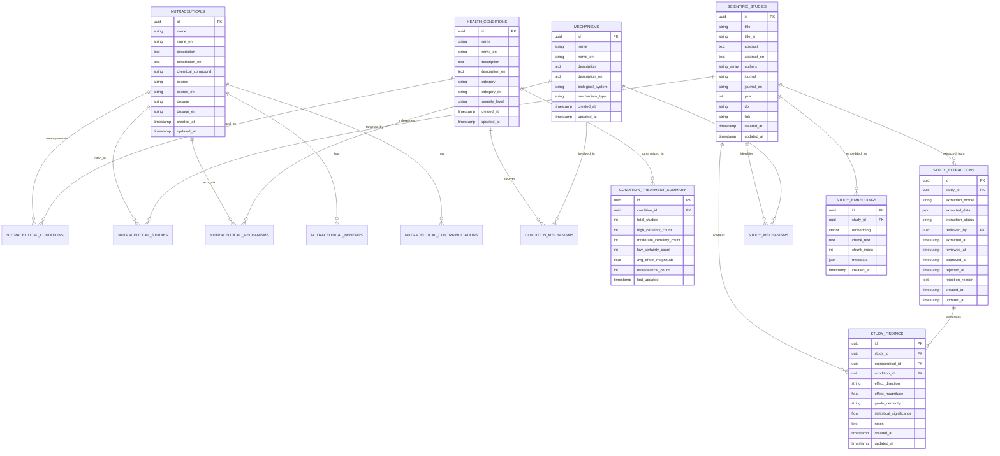
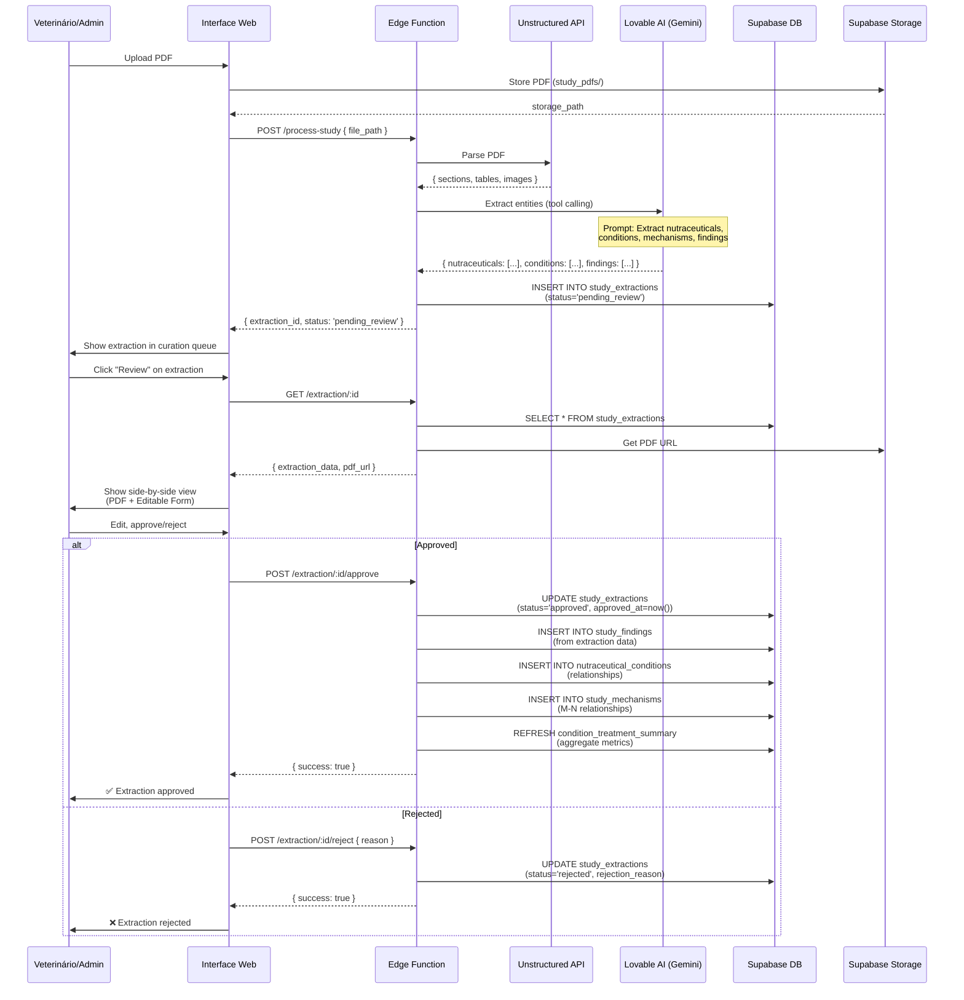
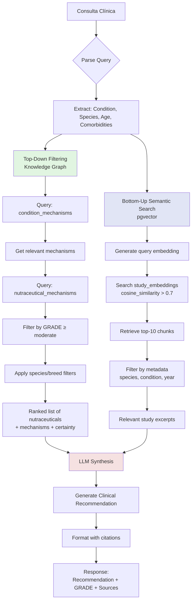

# NTAI Knowledge Graph Architecture

**Version:** 1.0.0  
**Última Atualização:** 2025-11-18  
**Autores:** Equipe NTAI  
**Status:** Foundation Design - Ready for Implementation

---

## 📋 Índice

1. [Visão Geral e Contexto](#1-visão-geral-e-contexto)
2. [Fundamentos Científicos](#2-fundamentos-científicos)
3. [Modelo de Dados Expandido](#3-modelo-de-dados-expandido)
4. [Workflow de Ingestão de Estudos](#4-workflow-de-ingestão-de-estudos)
5. [Sistema RAG Graph-Aware](#5-sistema-rag-graph-aware)
6. [Roadmap de Implementação](#6-roadmap-de-implementação)
7. [Sistema de Visualizações Interativas](#7-sistema-de-visualizações-interativas)
8. [Padrão Visual Unificado](#8-padrão-visual-unificado)
9. [Referências Científicas](#9-referências-científicas)

---

## 1. Visão Geral e Contexto

### 1.1 Contexto do Projeto NTAI

O NTAI (Nutraceutical Treatment AI) é um sistema inteligente de recomendação de nutracêuticos para pets que visa:

- **Complementar deficiências nutricionais** nas rações comerciais
- **Prevenir doenças degenerativas** com base em raça, exames e histórico clínico
- **Promover longevidade saudável** através de estratégias nutracêuticas personalizadas e baseadas em evidências científicas

### 1.2 Decisão Arquitetural: "Middle Ground"

Após análise de trade-offs, optamos por uma arquitetura **"Middle Ground"** que equilibra:

**❌ Não fizemos:**
- **MVP Simplista**: Lookup table básica sem rastreamento de mecanismos ou evidências
- **Knowledge Graph Complexo**: Sistema full-featured com reasoning, inferência temporal, multi-hop queries

**✅ Fizemos (Middle Ground):**
- **Base sólida**: Tabelas relacionais bem estruturadas com suporte a mechanisms, GRADE certainty, study findings
- **Evidência científica rigorosa**: Tracking completo de fontes, GRADE system, effect magnitude/direction
- **Desenvolvimento incremental**: 4-6 semanas para MVP funcional, com path claro para evolução

### 1.3 Objetivos e Princípios

**Objetivos:**
1. Criar base de conhecimento médico-científico verificável e auditável
2. Permitir recomendações clínicas com citação de evidências (transparência)
3. Identificar gaps de conhecimento para priorizar pesquisa futura
4. Suportar curadoria humana eficiente (veterinários aprovam extrações de IA)

**Princípios Arquiteturais:**
- **Evidence-Based Medicine (EBM)**: Toda recomendação deve ter fonte científica rastreável
- **Human-in-the-Loop**: IA acelera, humano valida (curadoria de extrações)
- **GRADE System**: Certeza da evidência (high/moderate/low/very low) é first-class citizen
- **Incrementalidade**: Ship fast, iterate based on feedback, avoid over-engineering

---

## 2. Fundamentos Científicos

### 2.1 GRADE System

**GRADE (Grading of Recommendations Assessment, Development and Evaluation)** é o padrão-ouro para avaliar qualidade de evidências médicas.

**Níveis de Certeza:**
- **High (⭐⭐⭐⭐)**: Confiança alta de que o efeito verdadeiro está próximo da estimativa
- **Moderate (⭐⭐⭐)**: Confiança moderada; efeito verdadeiro provavelmente está próximo, mas pode ser substancialmente diferente
- **Low (⭐⭐)**: Confiança limitada; efeito verdadeiro pode ser substancialmente diferente
- **Very Low (⭐)**: Muito pouca confiança; efeito verdadeiro provavelmente é muito diferente

**Fatores que afetam GRADE:**
- **Aumentam**: Large effect size, dose-response gradient, plausible confounders
- **Diminuem**: Risk of bias, inconsistency, indirectness, imprecision, publication bias

### 2.2 Evidence-Based Medicine (EBM) em Veterinária

**Hierarquia de Evidências:**
1. **Systematic Reviews & Meta-Analyses** (mais forte)
2. **Randomized Controlled Trials (RCTs)**
3. **Cohort Studies**
4. **Case-Control Studies**
5. **Case Series / Case Reports**
6. **Expert Opinion / Anecdotal Evidence** (mais fraco)

**Desafios em Veterinária:**
- Literatura menos abundante que medicina humana
- Heterogeneidade de espécies/raças
- Estudos em pets reais vs. modelos animais de laboratório
- Funding limitado para nutracêuticos (não patenteáveis)

### 2.3 Knowledge Graphs em Contexto Médico

**Por que Knowledge Graphs?**
- **Relacionamentos complexos**: Nutracêutico → Mechanism → Condition (não apenas Nutracêutico → Condition)
- **Multi-hop reasoning**: "Se Curcumin inibe COX-2 E COX-2 é upregulated em OA, então Curcumin pode ajudar OA"
- **Discoverable patterns**: Clustering de conditions por mechanisms comuns

**Exemplos em Medicina:**
- **PrimeKG** (Harvard Medical School): 129k entidades, 4M relações (drugs, diseases, genes, pathways)
- **UMLS Metathesaurus**: Integração de 200+ vocabulários médicos
- **DisGeNET**: Gene-disease associations com evidence scores

---

## 3. Modelo de Dados Expandido

### 3.1 Diagrama Entidade-Relacionamento



### 3.2 Tabelas Novas (SQL Schemas)

#### 3.2.1 Mechanisms (Hallmarks Biológicos)

```sql
CREATE TABLE public.mechanisms (
    id UUID NOT NULL DEFAULT gen_random_uuid() PRIMARY KEY,
    name TEXT NOT NULL UNIQUE,
    name_en TEXT,
    description TEXT,
    description_en TEXT,
    biological_system TEXT, -- 'inflammation', 'oxidative_stress', 'mitochondrial', 'autophagy', 'epigenetic', etc.
    mechanism_type TEXT, -- 'inhibition', 'activation', 'modulation', 'protection'
    created_at TIMESTAMP WITH TIME ZONE NOT NULL DEFAULT now(),
    updated_at TIMESTAMP WITH TIME ZONE NOT NULL DEFAULT now()
);

CREATE INDEX idx_mechanisms_biological_system ON public.mechanisms(biological_system);
CREATE INDEX idx_mechanisms_type ON public.mechanisms(mechanism_type);

-- Trigger para atualizar updated_at
CREATE TRIGGER update_mechanisms_updated_at
    BEFORE UPDATE ON public.mechanisms
    FOR EACH ROW
    EXECUTE FUNCTION public.update_updated_at_column();
```

#### 3.2.2 Study Findings (Expandido com GRADE)

```sql
CREATE TABLE public.study_findings (
    id UUID NOT NULL DEFAULT gen_random_uuid() PRIMARY KEY,
    study_id UUID NOT NULL REFERENCES public.scientific_studies(id) ON DELETE CASCADE,
    nutraceutical_id UUID NOT NULL REFERENCES public.nutraceuticals(id) ON DELETE CASCADE,
    condition_id UUID NOT NULL REFERENCES public.health_conditions(id) ON DELETE CASCADE,
    
    -- GRADE Evidence Quality
    effect_direction TEXT NOT NULL CHECK (effect_direction IN ('beneficial', 'neutral', 'harmful')),
    effect_magnitude NUMERIC(4,2) CHECK (effect_magnitude >= 0.0 AND effect_magnitude <= 10.0), -- 0.0-10.0 scale
    grade_certainty TEXT NOT NULL CHECK (grade_certainty IN ('high', 'moderate', 'low', 'very_low')),
    
    -- Statistical Data
    statistical_significance NUMERIC(5,4), -- p-value (0.0001-1.0000)
    confidence_interval_lower NUMERIC(6,2),
    confidence_interval_upper NUMERIC(6,2),
    sample_size INTEGER,
    
    -- Contextual Data
    dosage_used TEXT,
    duration_weeks INTEGER,
    species TEXT, -- 'canine', 'feline', 'both'
    notes TEXT,
    
    created_at TIMESTAMP WITH TIME ZONE NOT NULL DEFAULT now(),
    updated_at TIMESTAMP WITH TIME ZONE NOT NULL DEFAULT now()
);

CREATE INDEX idx_study_findings_study ON public.study_findings(study_id);
CREATE INDEX idx_study_findings_nutraceutical ON public.study_findings(nutraceutical_id);
CREATE INDEX idx_study_findings_condition ON public.study_findings(condition_id);
CREATE INDEX idx_study_findings_grade ON public.study_findings(grade_certainty);
CREATE INDEX idx_study_findings_effect_direction ON public.study_findings(effect_direction);

CREATE TRIGGER update_study_findings_updated_at
    BEFORE UPDATE ON public.study_findings
    FOR EACH ROW
    EXECUTE FUNCTION public.update_updated_at_column();
```

#### 3.2.3 Study Extractions (Buffer de Curadoria)

```sql
CREATE TABLE public.study_extractions (
    id UUID NOT NULL DEFAULT gen_random_uuid() PRIMARY KEY,
    study_id UUID NOT NULL REFERENCES public.scientific_studies(id) ON DELETE CASCADE,
    
    -- AI Extraction Metadata
    extraction_model TEXT NOT NULL, -- 'google/gemini-2.5-flash', 'openai/gpt-5', etc.
    extracted_data JSONB NOT NULL, -- Raw JSON output from LLM
    extraction_confidence NUMERIC(3,2), -- 0.0-1.0
    
    -- Curation Workflow
    extraction_status TEXT NOT NULL DEFAULT 'pending_review' CHECK (
        extraction_status IN ('pending_review', 'in_review', 'approved', 'rejected', 'merged')
    ),
    reviewed_by UUID, -- FK to profiles/users (nullable)
    extracted_at TIMESTAMP WITH TIME ZONE NOT NULL DEFAULT now(),
    reviewed_at TIMESTAMP WITH TIME ZONE,
    approved_at TIMESTAMP WITH TIME ZONE,
    rejected_at TIMESTAMP WITH TIME ZONE,
    rejection_reason TEXT,
    
    -- Version Control
    extraction_version INTEGER NOT NULL DEFAULT 1,
    superseded_by UUID REFERENCES public.study_extractions(id),
    
    created_at TIMESTAMP WITH TIME ZONE NOT NULL DEFAULT now(),
    updated_at TIMESTAMP WITH TIME ZONE NOT NULL DEFAULT now()
);

CREATE INDEX idx_study_extractions_study ON public.study_extractions(study_id);
CREATE INDEX idx_study_extractions_status ON public.study_extractions(extraction_status);
CREATE INDEX idx_study_extractions_model ON public.study_extractions(extraction_model);
CREATE INDEX idx_study_extractions_reviewed_by ON public.study_extractions(reviewed_by);

CREATE TRIGGER update_study_extractions_updated_at
    BEFORE UPDATE ON public.study_extractions
    FOR EACH ROW
    EXECUTE FUNCTION public.update_updated_at_column();
```

#### 3.2.4 Condition Treatment Summary (Agregações)

```sql
CREATE TABLE public.condition_treatment_summary (
    id UUID NOT NULL DEFAULT gen_random_uuid() PRIMARY KEY,
    condition_id UUID NOT NULL UNIQUE REFERENCES public.health_conditions(id) ON DELETE CASCADE,
    
    -- Aggregate Metrics
    total_studies INTEGER NOT NULL DEFAULT 0,
    high_certainty_count INTEGER NOT NULL DEFAULT 0,
    moderate_certainty_count INTEGER NOT NULL DEFAULT 0,
    low_certainty_count INTEGER NOT NULL DEFAULT 0,
    very_low_certainty_count INTEGER NOT NULL DEFAULT 0,
    
    avg_effect_magnitude NUMERIC(4,2), -- Average of all beneficial findings
    nutraceutical_count INTEGER NOT NULL DEFAULT 0, -- Distinct nutraceuticals
    mechanism_count INTEGER NOT NULL DEFAULT 0, -- Distinct mechanisms
    
    -- Treatability Score (computed)
    treatability_score NUMERIC(3,2) CHECK (treatability_score >= 0.0 AND treatability_score <= 1.0),
    
    last_updated TIMESTAMP WITH TIME ZONE NOT NULL DEFAULT now()
);

CREATE INDEX idx_condition_summary_condition ON public.condition_treatment_summary(condition_id);
CREATE INDEX idx_condition_summary_treatability ON public.condition_treatment_summary(treatability_score DESC NULLS LAST);
```

#### 3.2.5 Study Embeddings (pgvector para RAG)

```sql
-- Ensure pgvector extension is enabled
CREATE EXTENSION IF NOT EXISTS vector;

CREATE TABLE public.study_embeddings (
    id UUID NOT NULL DEFAULT gen_random_uuid() PRIMARY KEY,
    study_id UUID NOT NULL REFERENCES public.scientific_studies(id) ON DELETE CASCADE,
    
    -- Vector Embedding (1536 dimensions for text-embedding-3-small, 768 for sentence-transformers)
    embedding VECTOR(1536) NOT NULL,
    
    -- Text Chunk
    chunk_text TEXT NOT NULL,
    chunk_index INTEGER NOT NULL, -- Position in document (0, 1, 2, ...)
    
    -- Metadata for filtering
    metadata JSONB, -- { "section": "methods", "page": 5, "nutraceuticals": ["curcumin"], "conditions": ["osteoarthritis"] }
    
    created_at TIMESTAMP WITH TIME ZONE NOT NULL DEFAULT now()
);

CREATE INDEX idx_study_embeddings_study ON public.study_embeddings(study_id);
CREATE INDEX idx_study_embeddings_vector ON public.study_embeddings USING ivfflat (embedding vector_cosine_ops) WITH (lists = 100);
CREATE INDEX idx_study_embeddings_metadata ON public.study_embeddings USING gin(metadata);
```

#### 3.2.6 Tabelas M-N (Many-to-Many Relationships)

```sql
-- Study ↔ Mechanisms
CREATE TABLE public.study_mechanisms (
    id UUID NOT NULL DEFAULT gen_random_uuid() PRIMARY KEY,
    study_id UUID NOT NULL REFERENCES public.scientific_studies(id) ON DELETE CASCADE,
    mechanism_id UUID NOT NULL REFERENCES public.mechanisms(id) ON DELETE CASCADE,
    relevance_score NUMERIC(3,2), -- 0.0-1.0 (how central is this mechanism to the study?)
    created_at TIMESTAMP WITH TIME ZONE NOT NULL DEFAULT now(),
    UNIQUE(study_id, mechanism_id)
);

CREATE INDEX idx_study_mechanisms_study ON public.study_mechanisms(study_id);
CREATE INDEX idx_study_mechanisms_mechanism ON public.study_mechanisms(mechanism_id);

-- Condition ↔ Mechanisms
CREATE TABLE public.condition_mechanisms (
    id UUID NOT NULL DEFAULT gen_random_uuid() PRIMARY KEY,
    condition_id UUID NOT NULL REFERENCES public.health_conditions(id) ON DELETE CASCADE,
    mechanism_id UUID NOT NULL REFERENCES public.mechanisms(id) ON DELETE CASCADE,
    correlation_strength NUMERIC(3,2), -- 0.0-1.0 (based on literature consensus)
    created_at TIMESTAMP WITH TIME ZONE NOT NULL DEFAULT now(),
    UNIQUE(condition_id, mechanism_id)
);

CREATE INDEX idx_condition_mechanisms_condition ON public.condition_mechanisms(condition_id);
CREATE INDEX idx_condition_mechanisms_mechanism ON public.condition_mechanisms(mechanism_id);

-- Nutraceutical ↔ Mechanisms
CREATE TABLE public.nutraceutical_mechanisms (
    id UUID NOT NULL DEFAULT gen_random_uuid() PRIMARY KEY,
    nutraceutical_id UUID NOT NULL REFERENCES public.nutraceuticals(id) ON DELETE CASCADE,
    mechanism_id UUID NOT NULL REFERENCES public.mechanisms(id) ON DELETE CASCADE,
    mechanism_action TEXT CHECK (mechanism_action IN ('inhibits', 'activates', 'modulates', 'protects')),
    evidence_strength NUMERIC(3,2), -- 0.0-1.0
    created_at TIMESTAMP WITH TIME ZONE NOT NULL DEFAULT now(),
    UNIQUE(nutraceutical_id, mechanism_id)
);

CREATE INDEX idx_nutraceutical_mechanisms_nutraceutical ON public.nutraceutical_mechanisms(nutraceutical_id);
CREATE INDEX idx_nutraceutical_mechanisms_mechanism ON public.nutraceutical_mechanisms(mechanism_id);
```

---

## 4. Workflow de Ingestão de Estudos

### 4.1 Diagrama de Sequência



### 4.2 Detalhamento das Etapas

#### 4.2.1 Stage 1: Upload de PDF

**Tecnologia:** Supabase Storage + React Dropzone

```typescript
// UI Component
import { useDropzone } from 'react-dropzone';

const StudyUpload = () => {
  const onDrop = async (files: File[]) => {
    const file = files[0];
    const { data, error } = await supabase.storage
      .from('study_pdfs')
      .upload(`${Date.now()}_${file.name}`, file);
    
    if (data) {
      await processStudy(data.path);
    }
  };
  
  const { getRootProps, getInputProps } = useDropzone({ 
    onDrop, 
    accept: { 'application/pdf': ['.pdf'] },
    maxFiles: 1
  });
  
  return <div {...getRootProps()}>Drop PDF here</div>;
};
```

#### 4.2.2 Stage 2: Parsing com Unstructured API

**Tecnologia:** Unstructured.io (https://unstructured.io/)

```typescript
// Edge Function: supabase/functions/parse-study/index.ts
import { UnstructuredClient } from "unstructured-client";

const client = new UnstructuredClient({
  apiKeyAuth: Deno.env.get("UNSTRUCTURED_API_KEY"),
});

const parseResult = await client.general.partition({
  partitionParameters: {
    files: {
      content: pdfBuffer,
      fileName: "study.pdf",
    },
    strategy: "hi_res", // High-resolution mode (OCR + layout analysis)
    languages: ["eng"],
    extractImageBlockTypes: ["Image", "Table"],
  },
});

// Output structure:
// [
//   { type: "Title", text: "Efficacy of Curcumin in Canine OA" },
//   { type: "NarrativeText", text: "This study evaluated..." },
//   { type: "Table", text: "Treatment group | Control group | p-value\n50mg | 25mg | 0.003", metadata: { ... } },
//   { type: "Image", text: "[OCR'd text from image]", metadata: { ... } }
// ]
```

#### 4.2.3 Stage 3: Extração com LLM (Tool Calling)

**Tecnologia:** Lovable AI Gateway (google/gemini-2.5-flash)

```typescript
// Edge Function: supabase/functions/extract-study-entities/index.ts
import { createClient } from '@supabase/supabase-js';

const extractEntities = async (studyText: string) => {
  const response = await fetch(`${Deno.env.get("VITE_SUPABASE_URL")}/functions/v1/ai/chat`, {
    method: 'POST',
    headers: {
      'Content-Type': 'application/json',
      'Authorization': `Bearer ${Deno.env.get("SUPABASE_ANON_KEY")}`,
    },
    body: JSON.stringify({
      model: 'google/gemini-2.5-flash',
      messages: [
        {
          role: 'system',
          content: `You are a veterinary scientific literature extraction expert. 
Extract structured data from the provided study text using the tools provided.`
        },
        {
          role: 'user',
          content: studyText
        }
      ],
      tools: [
        {
          type: 'function',
          function: {
            name: 'extract_study_findings',
            description: 'Extract nutraceuticals, conditions, mechanisms, and findings from a veterinary study',
            parameters: {
              type: 'object',
              properties: {
                nutraceuticals: {
                  type: 'array',
                  items: {
                    type: 'object',
                    properties: {
                      name: { type: 'string' },
                      dosage: { type: 'string' },
                      chemical_compound: { type: 'string' }
                    }
                  }
                },
                conditions: {
                  type: 'array',
                  items: {
                    type: 'object',
                    properties: {
                      name: { type: 'string' },
                      icd10_code: { type: 'string' }
                    }
                  }
                },
                mechanisms: {
                  type: 'array',
                  items: {
                    type: 'object',
                    properties: {
                      name: { type: 'string' },
                      biological_system: { type: 'string', enum: ['inflammation', 'oxidative_stress', 'mitochondrial', 'autophagy'] }
                    }
                  }
                },
                findings: {
                  type: 'array',
                  items: {
                    type: 'object',
                    properties: {
                      nutraceutical: { type: 'string' },
                      condition: { type: 'string' },
                      effect_direction: { type: 'string', enum: ['beneficial', 'neutral', 'harmful'] },
                      effect_magnitude: { type: 'number', minimum: 0, maximum: 10 },
                      grade_certainty: { type: 'string', enum: ['high', 'moderate', 'low', 'very_low'] },
                      statistical_significance: { type: 'number' }
                    }
                  }
                }
              },
              required: ['nutraceuticals', 'conditions', 'findings']
            }
          }
        }
      ],
      tool_choice: 'auto'
    })
  });
  
  const result = await response.json();
  return result.choices[0].message.tool_calls[0].function.arguments;
};
```

#### 4.2.4 Stage 4: Curadoria Humana

**Tecnologia:** React Component com side-by-side layout

```tsx
// src/components/administrador/estudos/curation/CurationScreen.tsx
const CurationScreen = ({ extractionId }: { extractionId: string }) => {
  const { data: extraction } = useQuery(['extraction', extractionId], () => 
    fetchExtraction(extractionId)
  );
  
  return (
    <div className="grid grid-cols-2 gap-4 h-screen">
      {/* Left Panel: PDF Viewer */}
      <div className="border rounded p-4">
        <iframe src={extraction.pdf_url} className="w-full h-full" />
      </div>
      
      {/* Right Panel: Editable Form + Mini-Graph */}
      <div className="border rounded p-4 overflow-y-auto">
        <MiniNetworkGraph extraction={extraction} />
        
        <Form>
          <FormField label="Nutraceutical" value={extraction.data.nutraceuticals[0].name} />
          <FormField label="Condition" value={extraction.data.conditions[0].name} />
          
          <MultiSelect 
            label="Mechanisms" 
            options={mechanismOptions}
            value={extraction.data.mechanisms}
          />
          
          <Select 
            label="Effect Direction" 
            options={['beneficial', 'neutral', 'harmful']}
            value={extraction.data.findings[0].effect_direction}
          />
          
          <Slider 
            label="Effect Magnitude (0-10)" 
            min={0} 
            max={10} 
            step={0.1}
            value={extraction.data.findings[0].effect_magnitude}
          />
          
          <Select 
            label="GRADE Certainty" 
            options={['high', 'moderate', 'low', 'very_low']}
            value={extraction.data.findings[0].grade_certainty}
          />
          
          <div className="flex gap-2 mt-4">
            <Button variant="default" onClick={handleApprove}>Approve</Button>
            <Button variant="destructive" onClick={handleReject}>Reject</Button>
            <Button variant="outline" onClick={handleSaveDraft}>Save Draft</Button>
          </div>
        </Form>
      </div>
    </div>
  );
};
```

#### 4.2.5 Stage 5: Approval e Integração ao Knowledge Graph

**Tecnologia:** Edge Function + Supabase Transactions

```typescript
// Edge Function: supabase/functions/approve-extraction/index.ts
const approveExtraction = async (extractionId: string, curatedData: any) => {
  const supabase = createClient(/* ... */);
  
  // Start transaction
  const { data: extraction } = await supabase
    .from('study_extractions')
    .update({ 
      extraction_status: 'approved', 
      approved_at: new Date().toISOString(),
      extracted_data: curatedData // Save curated version
    })
    .eq('id', extractionId)
    .select()
    .single();
  
  // Insert findings
  const findings = curatedData.findings.map(f => ({
    study_id: extraction.study_id,
    nutraceutical_id: f.nutraceutical_id, // Resolved from name
    condition_id: f.condition_id, // Resolved from name
    effect_direction: f.effect_direction,
    effect_magnitude: f.effect_magnitude,
    grade_certainty: f.grade_certainty,
    statistical_significance: f.statistical_significance
  }));
  
  await supabase.from('study_findings').insert(findings);
  
  // Insert mechanisms (M-N relationships)
  const studyMechanisms = curatedData.mechanisms.map(m => ({
    study_id: extraction.study_id,
    mechanism_id: m.mechanism_id,
    relevance_score: m.relevance_score || 0.8
  }));
  
  await supabase.from('study_mechanisms').insert(studyMechanisms);
  
  // Refresh aggregations
  await refreshConditionSummaries([...new Set(findings.map(f => f.condition_id))]);
  
  return { success: true };
};
```

---

## 5. Sistema RAG Graph-Aware

### 5.1 Diagrama de Fluxo



### 5.2 Detalhamento Técnico

#### 5.2.1 Top-Down Filtering (Knowledge Graph)

**Objetivo:** Pre-filter candidates using structured relationships

```sql
-- Example query: "Best nutraceutical for osteoarthritis in Labrador, 8 years old"

-- Step 1: Get condition ID
SELECT id FROM health_conditions WHERE name ILIKE '%osteoarthritis%';
-- condition_id = 'abc-123'

-- Step 2: Get mechanisms for this condition
SELECT m.id, m.name, cm.correlation_strength
FROM mechanisms m
JOIN condition_mechanisms cm ON m.id = cm.mechanism_id
WHERE cm.condition_id = 'abc-123'
ORDER BY cm.correlation_strength DESC
LIMIT 10;
-- mechanisms: ['inflammation', 'oxidative_stress', 'cartilage_degradation']

-- Step 3: Get nutraceuticals targeting these mechanisms
SELECT DISTINCT n.id, n.name, nm.evidence_strength, sf.grade_certainty, AVG(sf.effect_magnitude) as avg_effect
FROM nutraceuticals n
JOIN nutraceutical_mechanisms nm ON n.id = nm.nutraceutical_id
JOIN study_findings sf ON n.id = sf.nutraceutical_id
WHERE nm.mechanism_id IN ('inflammation_id', 'oxidative_stress_id', 'cartilage_degradation_id')
  AND sf.condition_id = 'abc-123'
  AND sf.grade_certainty IN ('high', 'moderate')
  AND sf.effect_direction = 'beneficial'
GROUP BY n.id, n.name, nm.evidence_strength, sf.grade_certainty
ORDER BY 
  CASE sf.grade_certainty 
    WHEN 'high' THEN 4 
    WHEN 'moderate' THEN 3 
    ELSE 1 
  END DESC,
  avg_effect DESC
LIMIT 5;
-- Result: [Glucosamine+Chondroitin, Curcumin, Omega-3, Green-lipped Mussel, Boswellia]
```

#### 5.2.2 Bottom-Up Semantic Search (pgvector)

**Objetivo:** Retrieve textual evidence from studies

```typescript
// Edge Function: supabase/functions/rag-search/index.ts
const semanticSearch = async (query: string, condition_id: string, species: string) => {
  // 1. Generate embedding for query
  const embeddingResponse = await fetch(`${SUPABASE_URL}/functions/v1/ai/embeddings`, {
    method: 'POST',
    headers: { 'Authorization': `Bearer ${SUPABASE_ANON_KEY}` },
    body: JSON.stringify({
      model: 'text-embedding-3-small', // 1536 dimensions
      input: query
    })
  });
  const { embedding } = await embeddingResponse.json();
  
  // 2. Search study_embeddings with cosine similarity
  const { data: chunks } = await supabase.rpc('search_study_chunks', {
    query_embedding: embedding,
    similarity_threshold: 0.7,
    match_count: 10,
    filter_metadata: {
      condition_id: condition_id,
      species: species
    }
  });
  
  // 3. Return chunks with metadata
  return chunks.map(c => ({
    study_id: c.study_id,
    text: c.chunk_text,
    similarity: c.similarity,
    metadata: c.metadata
  }));
};

// Postgres function for vector search
CREATE OR REPLACE FUNCTION search_study_chunks(
  query_embedding VECTOR(1536),
  similarity_threshold FLOAT,
  match_count INT,
  filter_metadata JSONB DEFAULT NULL
)
RETURNS TABLE (
  study_id UUID,
  chunk_text TEXT,
  similarity FLOAT,
  metadata JSONB
)
LANGUAGE plpgsql
AS $$
BEGIN
  RETURN QUERY
  SELECT 
    se.study_id,
    se.chunk_text,
    1 - (se.embedding <=> query_embedding) AS similarity,
    se.metadata
  FROM study_embeddings se
  WHERE 
    (1 - (se.embedding <=> query_embedding)) > similarity_threshold
    AND (
      filter_metadata IS NULL 
      OR (
        se.metadata @> filter_metadata
      )
    )
  ORDER BY se.embedding <=> query_embedding
  LIMIT match_count;
END;
$$;
```

#### 5.2.3 LLM Synthesis

**Objetivo:** Combine graph results + textual chunks into clinical recommendation

```typescript
// Edge Function: supabase/functions/rag-synthesize/index.ts
const synthesizeRecommendation = async (
  graphResults: any[], 
  textChunks: any[], 
  query: string
) => {
  const prompt = `You are a veterinary clinical decision support system. 
Generate a clinical recommendation based on:

**Query:** ${query}

**Structured Knowledge (from Knowledge Graph):**
${graphResults.map(r => `- ${r.nutraceutical_name}: GRADE ${r.grade_certainty}, Effect Magnitude ${r.avg_effect}/10, Mechanisms: ${r.mechanisms.join(', ')}`).join('\n')}

**Textual Evidence (from studies):**
${textChunks.map((c, i) => `[${i+1}] ${c.text} (Study ID: ${c.study_id}, Similarity: ${c.similarity.toFixed(2)})`).join('\n\n')}

**Instructions:**
1. Synthesize a clinical recommendation prioritizing nutraceuticals with HIGH or MODERATE GRADE certainty
2. Explain the mechanisms of action
3. Mention effect magnitude and statistical significance
4. Cite studies using [1], [2], etc. notation
5. Note any adverse events or contraindications
6. Format as: Recommendation → Mechanisms → Evidence → Precautions

**Output format:**
{
  "recommendation": "Recommended nutraceutical and dosage",
  "mechanisms": ["mechanism 1", "mechanism 2"],
  "evidence_summary": "...",
  "grade_certainty": "high/moderate",
  "effect_magnitude": 7.5,
  "citations": [{ "study_id": "...", "title": "...", "year": 2023 }],
  "precautions": "..."
}`;

  const response = await fetch(`${SUPABASE_URL}/functions/v1/ai/chat`, {
    method: 'POST',
    body: JSON.stringify({
      model: 'google/gemini-2.5-flash',
      messages: [
        { role: 'system', content: 'You are a veterinary clinical expert.' },
        { role: 'user', content: prompt }
      ],
      response_format: { type: 'json_object' }
    })
  });
  
  const result = await response.json();
  return JSON.parse(result.choices[0].message.content);
};
```

---

## 6. Roadmap de Implementação

### 6.1 Fase 1: Foundation (Semana 1)

**Objetivo:** Criar infraestrutura de banco de dados e modelos base

**Tarefas:**
- [ ] Criar tabelas: `mechanisms`, `study_findings`, `study_extractions`, `condition_treatment_summary`, `study_embeddings`
- [ ] Criar tabelas M-N: `study_mechanisms`, `condition_mechanisms`, `nutraceutical_mechanisms`
- [ ] Implementar triggers para `updated_at`
- [ ] Popular tabela `mechanisms` com hallmarks iniciais (15-20 mechanisms padrão)
- [ ] Criar view `clean_seed_data` para combinar dados de produção + seed

**Entregável:** Banco de dados pronto para ingestão de estudos

---

### 6.2 Fase 2: Parsing + Extraction (Semana 1-2)

**Objetivo:** Implementar pipeline de ingestão automática

**Tarefas:**
- [ ] Integrar Unstructured API (criar conta, obter API key, adicionar secret)
- [ ] Criar edge function `parse-study` (upload PDF → Unstructured → JSON)
- [ ] Criar edge function `extract-study-entities` (JSON → LLM tool calling → structured data)
- [ ] Implementar batch processing (fila para processar múltiplos PDFs)
- [ ] Criar UI para upload de PDFs (drag-and-drop)
- [ ] Criar dashboard de monitoramento (quantos estudos em fila, avg processing time)

**Entregável:** Pipeline funcionando end-to-end (PDF → extraction JSON)

---

### 6.3 Fase 3: Curadoria (Semana 2-3)

**Objetivo:** Implementar interface de curadoria humana

**Tarefas:**
- [ ] Criar tela side-by-side (PDF viewer + editable form)
- [ ] Implementar mini-graph visualizando relações extraídas (vis-network)
- [ ] Criar form fields editáveis (nutraceutical, condition, mechanisms, GRADE)
- [ ] Implementar ações: Approve, Reject, Save Draft, Merge with existing
- [ ] Criar modal "Approval Impact Preview" (antes de aprovar, mostrar o que vai mudar no KG)
- [ ] Implementar sistema de "Pending Entities" (novos mechanisms sugeridos pela IA)

**Entregável:** Interface de curadoria completa e funcional

---

### 6.4 Fase 4: Knowledge Graph Enrichment (Semana 3-4)

**Objetivo:** Enriquecer grafo com relações M-N e agregações

**Tarefas:**
- [ ] Implementar lógica de approval: extraction → study_findings + M-N relationships
- [ ] Criar função de refresh para `condition_treatment_summary` (triggered por approval)
- [ ] Implementar algoritmo de cálculo de tratabilidade (eficácia × estudos × diversidade)
- [ ] Criar job scheduled para recalcular agregações diariamente
- [ ] Implementar "quality scoring" (confidence in mechanism-condition correlations)
- [ ] Popular mechanisms ontology com synonyms (e.g., "oxidative stress" = "ROS accumulation")

**Entregável:** Knowledge Graph com relações completas e agregações funcionando

---

### 6.5 Fase 5: RAG Implementation (Semana 4-5)

**Objetivo:** Implementar sistema RAG graph-aware

**Tarefas:**
- [ ] Ativar extensão pgvector no Supabase
- [ ] Implementar chunking strategy (500 tokens, overlap 100)
- [ ] Criar edge function `generate-embeddings` (texto → embedding via Lovable AI)
- [ ] Processar embeddings para todos os estudos existentes (batch job)
- [ ] Implementar função `search_study_chunks` (PostgreSQL + pgvector)
- [ ] Criar edge function `rag-search` (query → top-down + bottom-up → LLM synthesis)
- [ ] Testar com 10-20 consultas clínicas reais
- [ ] Otimizar thresholds (similarity, GRADE filtering, top-k)

**Entregável:** Sistema RAG funcionando com consultas clínicas

---

### 6.6 Fase 6: Monitoring + Optimization (Semana 5-6)

**Objetivo:** Dashboards, metrics, e otimizações de performance

**Tarefas:**
- [ ] Criar "Extraction Quality Monitor" (approval rate, rejection reasons, pending entities)
- [ ] Criar "Knowledge Gap Analysis" (heatmap Condition × Mechanism, lista de gaps)
- [ ] Criar "RAG Query Visualizer" (debug/demo: top-down + vector + LLM)
- [ ] Implementar alertas para inconsistências (findings contraditórios)
- [ ] Otimizar queries pesadas (adicionar indexes, materialized views)
- [ ] Criar documentação de uso para veterinários (onboarding)
- [ ] Preparar dataset de demo para Stanford (10-15 estudos curados, 3-5 conditions)

**Entregável:** Sistema completo, monitorado, e pronto para demo

---

## 7. Sistema de Visualizações Interativas

### 7.1 Network Graph de Mechanisms ↔ Conditions

**Tecnologia:** `vis-network` (já usado no projeto)

**Dados:**
- Nós: `mechanisms` (azul), `conditions` (verde)
- Arestas: `condition_mechanisms` (espessura = correlation_strength)

**Características Visuais:**
- Tamanho do nó proporcional ao número de conexões (degree centrality)
- Espessura da aresta = força da correlação (0.0-1.0)
- Tooltip ao hover: detalhes do mechanism/condition, citações de estudos
- Filtros interativos: por sistema biológico, por espécie

**Wireframe (Mermaid):**

```mermaid
graph TD
    subgraph "Network Graph Viewer"
        A[Filter Panel<br/>System: All | Species: All]
        B[Canvas with vis-network]
        C[Legend<br/>Blue=Mechanism | Green=Condition]
        D[Selected Node Details Panel]
    end
```

---

### 7.2 Evidence Heatmap (GRADE Certainty)

**Tecnologia:** Recharts

**Dados:**
- Matrix: `conditions` (linhas) × `nutraceuticals` (colunas)
- Valores: `grade_certainty` (cor) + `effect_magnitude` (intensidade)

**Características Visuais:**
- Cor da célula: verde=high, amarelo=moderate, laranja=low, cinza=none
- Intensidade: 0.0-10.0 (effect_magnitude)
- Hover: tooltip com effect_direction, número de estudos, link para detalhes

**Wireframe (Mermaid):**

```mermaid
graph TD
    subgraph "Evidence Heatmap"
        A[Filter: Species | Breed | Year Range]
        B[Heatmap Grid<br/>Conditions × Nutraceuticals]
        C[Color Legend<br/>GRADE: High | Moderate | Low | None]
        D[Tooltip on Hover:<br/>Effect Magnitude, Studies, Citations]
    end
```

---

### 7.3 Real-Time Processing Dashboard (Pipeline)

**Tecnologia:** Componentes animados (similar a `AIProcessingVisualization.tsx`)

**Dados:** `study_extractions` (status, timestamps)

**Características Visuais:**
- 5 estágios: [PDF Upload] → [Unstructured Parsing] → [LLM Extraction] → [Human Curation] → [Knowledge Graph]
- Animação de "fluxo" entre estágios (particles movendo-se)
- Métricas em tempo real: Total queued, Avg processing time, Pending curation, Approval rate
- Log stream: últimas 10 ações

**Wireframe (Mermaid):**

```mermaid
graph LR
    A[PDF Upload<br/>📄 5 queued] -->|Parsing| B[Unstructured<br/>⚙️ 2 processing]
    B -->|Extraction| C[LLM<br/>🤖 3 extracting]
    C -->|Curation| D[Human Review<br/>👨‍⚕️ 8 pending]
    D -->|Approval| E[Knowledge Graph<br/>✅ 42 integrated]
    
    F[Metrics Panel<br/>Avg time: 2.3min | Approval: 87%]
    G[Activity Log<br/>Study ABC → Approved | Study XYZ → Rejected]
```

---

### 7.4 Extraction Quality Monitor

**Tecnologia:** Recharts (line chart + table)

**Dados:** `study_extractions` aggregated by date

**Características Visuais:**
- Line chart: % de aprovação/rejeição ao longo do tempo (últimos 30 dias)
- Tabela "Pending Entities": novos mechanisms sugeridos pela IA
- Ações: Approve, Reject, Merge with existing

**Wireframe (Mermaid):**

```mermaid
graph TD
    subgraph "Extraction Quality Monitor"
        A[Line Chart: Approval Rate Over Time]
        B[Rejection Reasons Breakdown<br/>Pie Chart]
        C[Pending Entities Table<br/>Mechanism | Proposed by AI | Study Count | Actions]
        D[Alert: Approval rate < 70% → Review prompts]
    end
```

---

### 7.5 Tela de Curadoria Side-by-Side (Enhanced)

**Tecnologia:** React + `react-resizable-panels`

**Dados:** `study_extractions` (single record)

**Características Visuais:**
- Painel esquerdo (50%): PDF preview (embedded iframe)
- Painel direito (50%): Mini-graph + Form editável
- Badges coloridas para effect_direction (verde=beneficial, vermelho=harmful)

**Wireframe (Mermaid):**

```mermaid
graph LR
    subgraph "Curation Screen (Split View)"
        A[PDF Viewer<br/>iframe with study]
        B[Mini Network Graph<br/>Study → Nutraceutical → Condition → Mechanisms]
        C[Editable Form<br/>Nutraceutical | Condition | Mechanisms<br/>Effect Direction | Magnitude | GRADE]
        D[Actions<br/>Approve | Reject | Save Draft]
    end
```

---

### 7.6 Approval Impact Preview (Modal)

**Tecnologia:** React Modal (shadcn Dialog)

**Dados:** Simulação de "Before vs. After"

**Características Visuais:**
- Seção "Changes to Knowledge Graph" (texto descritivo)
- Seção "Updated Statistics" (mini bar chart Before/After)
- Botões: Confirm Approval, Cancel

**Wireframe (Mermaid):**

```mermaid
graph TD
    subgraph "Approval Impact Preview Modal"
        A[Changes to KG<br/>+1 study for Osteoarthritis<br/>GRADE upgraded: low → moderate]
        B[Updated Statistics<br/>Before: 42 studies | After: 43 studies<br/>High certainty: 8 → 9]
        C[Mini Bar Chart<br/>GRADE distribution Before vs After]
        D[Buttons: Confirm | Cancel]
    end
```

---

### 7.7 RAG Query Visualizer (Debug/Demo)

**Tecnologia:** Dashboard interno (aba Admin → AI Insights)

**Dados:** Logs de consultas RAG

**Características Visuais:**
- Input box para consulta de teste
- 3 colunas: Top-down (grafo), Vector search (chunks), LLM synthesis (final)
- Citações clicáveis (abre PDF do estudo)

**Wireframe (Mermaid):**

```mermaid
graph TD
    subgraph "RAG Query Visualizer"
        A[Input: Clinical Query]
        B[Column 1: Top-Down Filter<br/>Condition → Mechanisms → Nutraceuticals]
        C[Column 2: Vector Search Results<br/>Top-10 chunks with similarity scores]
        D[Column 3: LLM Synthesis<br/>Final recommendation with citations]
        E[Performance Metrics<br/>Latency: top-down 50ms | vector 120ms | LLM 1.2s]
    end
```

---

### 7.8 Knowledge Gap Analysis (Dashboard)

**Tecnologia:** Dashboard (aba Admin → Veterinary Targets ou AI Insights)

**Dados:** Agregações de `condition_treatment_summary`, `condition_mechanisms`

**Características Visuais:**
- Heatmap Condition × Mechanism (cor = número de estudos)
- Lista de "Knowledge Gaps" (tabela ordenada por gap severity)
- Botão "Suggest Research Priorities" (LLM gera keywords para busca)

**Wireframe (Mermaid):**

```mermaid
graph TD
    subgraph "Knowledge Gap Analysis"
        A[Heatmap: Condition × Mechanism<br/>Color: # of studies green=many, gray=zero]
        B[Knowledge Gaps Table<br/>Condition | Mechanism | Studies | Gap Severity]
        C[Top 10 Conditions with Largest Gaps<br/>Bar Chart]
        D[Button: Suggest Research Priorities → LLM generates keywords]
    end
```

---

## 8. Padrão Visual Unificado

### 8.1 Paleta de Cores Científica

```css
/* GRADE Certainty */
--grade-high: hsl(142, 71%, 45%);        /* Verde #10b981 */
--grade-moderate: hsl(45, 93%, 47%);     /* Amarelo #eab308 */
--grade-low: hsl(25, 95%, 53%);          /* Laranja #f97316 */
--grade-very-low: hsl(220, 9%, 46%);     /* Cinza #9ca3af */

/* Effect Direction */
--effect-beneficial: hsl(142, 77%, 88%);  /* Verde claro #d1fae5 */
--effect-neutral: hsl(45, 93%, 88%);      /* Amarelo claro #fef9c3 */
--effect-harmful: hsl(0, 86%, 94%);       /* Vermelho claro #fee2e2 */

/* Entidades */
--entity-mechanism: hsl(217, 91%, 60%);   /* Azul #3b82f6 */
--entity-condition: hsl(142, 71%, 45%);   /* Verde #10b981 */
--entity-nutraceutical: hsl(271, 81%, 56%); /* Roxo #a855f7 */
--entity-study: hsl(280, 67%, 53%);       /* Roxo escuro #9333ea */
```

### 8.2 Animações Sutis

```css
/* Transições */
.smooth-transition {
  transition: all 300ms cubic-bezier(0.4, 0, 0.2, 1);
}

/* Fade-in para gráficos */
@keyframes fadeIn {
  from { opacity: 0; transform: translateY(10px); }
  to { opacity: 1; transform: translateY(0); }
}

.chart-container {
  animation: fadeIn 500ms ease-out;
}

/* Pulse para elementos "pending review" */
@keyframes pulse {
  0%, 100% { opacity: 1; }
  50% { opacity: 0.6; }
}

.pending-review {
  animation: pulse 2s cubic-bezier(0.4, 0, 0.6, 1) infinite;
}
```

### 8.3 Tipografia

```css
/* Headings */
.heading {
  font-family: 'Inter', sans-serif;
  font-weight: 600; /* Semibold */
}

/* Body Text */
.body-text {
  font-family: 'Inter', sans-serif;
  font-weight: 400; /* Regular */
}

/* Monospace (IDs, códigos) */
.monospace {
  font-family: 'JetBrains Mono', 'Courier New', monospace;
  font-size: 0.875rem; /* 14px */
}
```

### 8.4 Componentes Base (shadcn/ui)

- **Buttons**: `variant="default"` (primary), `variant="outline"` (secondary), `variant="destructive"` (danger)
- **Badges**: `variant="default"` (neutral), `variant="secondary"` (muted), `variant="outline"` (low emphasis)
- **Cards**: `border`, `rounded-lg`, `shadow-sm`
- **Dialogs**: `max-w-3xl` (large modals), `max-w-md` (small modals)
- **Tables**: `hover:bg-muted/50` (subtle hover effect)

---

## 9. Referências Científicas

### 9.1 GRADE System

- **Official Website:** https://www.gradeworkinggroup.org/
- **Handbook:** Schünemann HJ, et al. (2013). "GRADE handbook for grading quality of evidence and strength of recommendations." Updated October 2013.

### 9.2 Evidence-Based Medicine

- **Cochrane Collaboration:** https://www.cochrane.org/
- **Centre for Evidence-Based Medicine (CEBM):** https://www.cebm.ox.ac.uk/

### 9.3 Veterinary Medicine Journals

- **Journal of Veterinary Internal Medicine (JVIM):** https://onlinelibrary.wiley.com/journal/19391676
- **Journal of the American Veterinary Medical Association (JAVMA):** https://avmajournals.avma.org/loi/javma
- **American Animal Hospital Association (AAHA):** https://www.aaha.org/

### 9.4 PubMed and Scientific Databases

- **PubMed Central:** https://www.ncbi.nlm.nih.gov/pmc/
- **SciSpace (formerly Typeset):** https://scispace.com/
- **Google Scholar:** https://scholar.google.com/

### 9.5 Knowledge Graphs in Medicine

- **PrimeKG (Harvard):** Chandak P, et al. (2023). "Building a knowledge graph to enable precision medicine." Scientific Data, 10(1), 67. https://doi.org/10.1038/s41597-023-01960-3
- **Medical Knowledge Graphs:** Rotmensch M, et al. (2017). "Learning a health knowledge graph from electronic medical records." Scientific Reports, 7, 5994. https://doi.org/10.1038/s41598-017-05778-z

### 9.6 RAG in Clinical Context

- **Retrieval-Augmented Generation for Clinical Decision Support:** Lewis P, et al. (2020). "Retrieval-Augmented Generation for Knowledge-Intensive NLP Tasks." NeurIPS 2020. https://arxiv.org/abs/2005.11401
- **Clinical RAG Systems:** Zakka C, et al. (2024). "Almanac: Retrieval-Augmented Language Models for Clinical Medicine." arXiv:2404.01627.

### 9.7 Natural Language Processing for Biomedical Text

- **PubMedBERT:** Gu Y, et al. (2021). "Domain-Specific Language Model Pretraining for Biomedical Natural Language Processing." ACM Transactions on Computing for Healthcare. https://arxiv.org/abs/2007.15779
- **BioGPT:** Luo R, et al. (2022). "BioGPT: Generative Pre-trained Transformer for Biomedical Text Generation and Mining." Briefings in Bioinformatics, 23(6). https://doi.org/10.1093/bib/bbac409

---

## 📊 Conclusão e Próximos Passos

Este documento define a arquitetura completa do NTAI Knowledge Graph, equilibrando rigor científico com pragmatismo de desenvolvimento. A implementação seguirá o roadmap de 6 fases (4-6 semanas), priorizando:

1. **Foundation sólida**: Modelo de dados expansível, com suporte a mechanisms e GRADE certainty
2. **Automação inteligente**: Pipeline de ingestão com IA acelerando 70-80% do trabalho
3. **Curadoria humana eficiente**: Veterinários aprovam extrações, garantindo qualidade
4. **Recomendações rastreáveis**: Sistema RAG graph-aware com citações de estudos
5. **Visualizações impactantes**: 8 visualizações "WOW" para demonstração e análise

**Timeline para Stanford Demo:** Pronto após Semana 6 (com dataset curado de 10-15 estudos, 3-5 conditions prioritárias).

**Manutenção desta Documentação:** Este arquivo será atualizado à medida que decisões arquiteturais evoluírem. Versão atual: 1.0.0 (2025-11-18).

---

**Contato:** Para dúvidas ou sugestões sobre esta arquitetura, contatar equipe NTAI.
