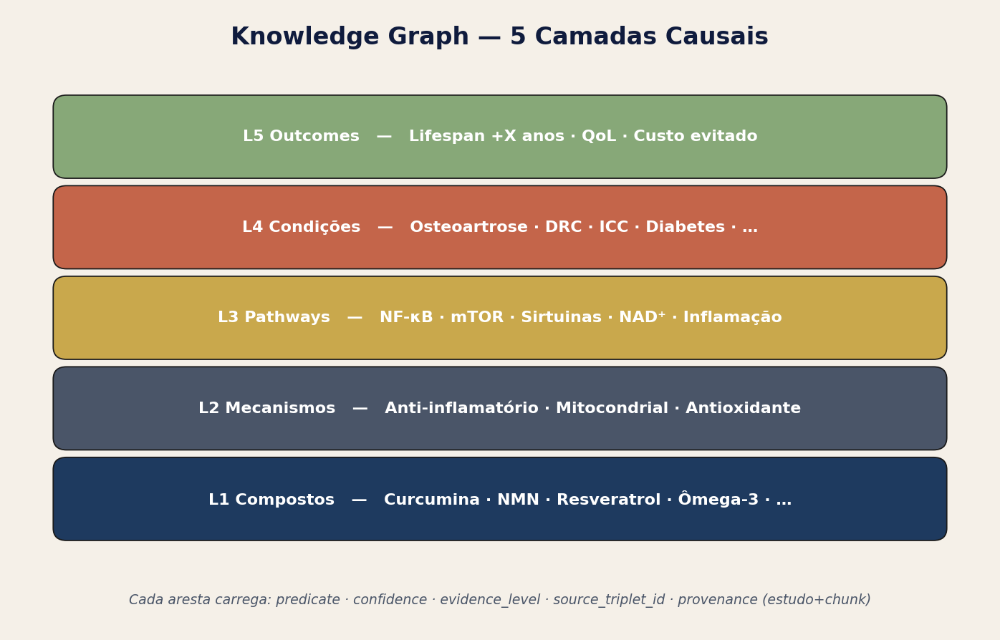
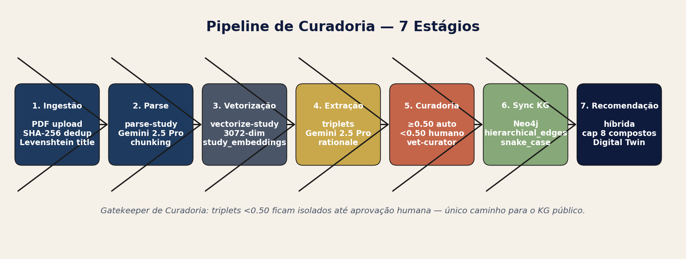
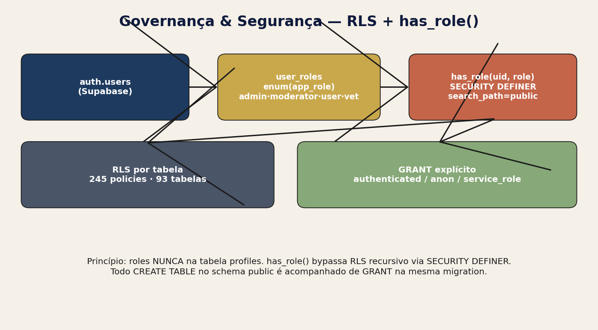
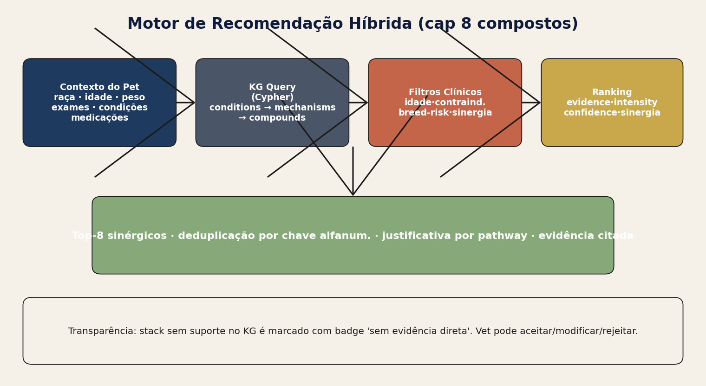
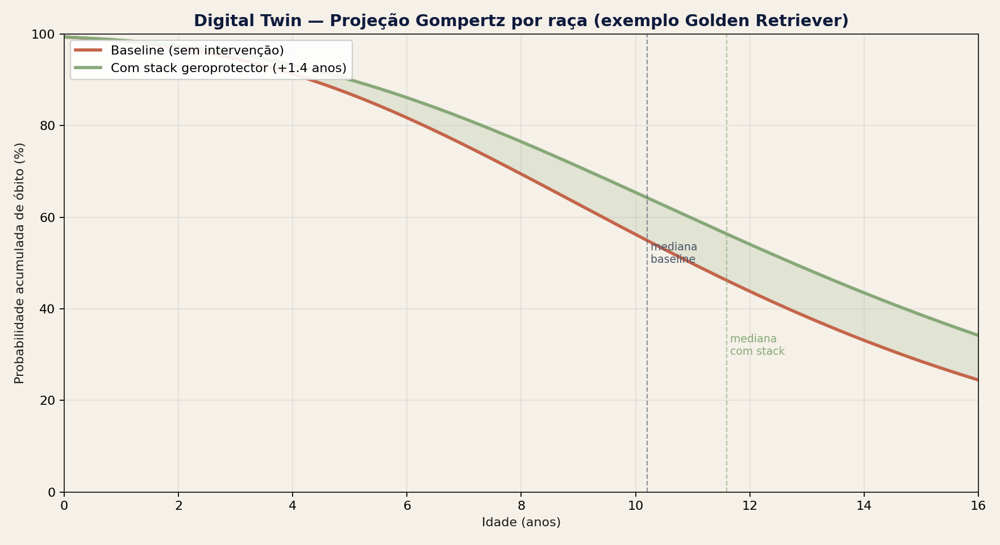
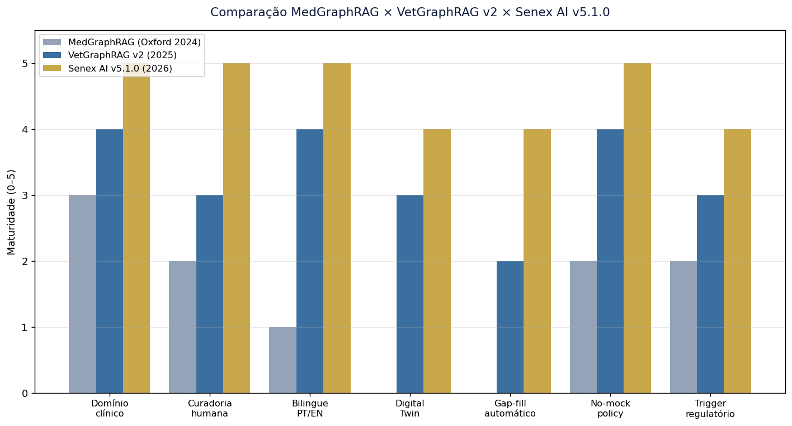

# Auditoria Técnica Senex AI — v5.2.0

**Versão:** 5.2.0 · **Data:** 31/05/2026 · **i18n:** 1.115.6 · **Tipo:** standalone cumulativa  
**Substitui:** v5.1.0 (18/05/2026) · **Autoria operacional:** PetMoreTime · **Marca pública:** Senex AI

> Esta auditoria é **auto-suficiente**. Herda integralmente a base estrutural da v3 (10/05/2026) e da v5.1.0 (18/05/2026), atualiza métricas vivas do banco e marca explicitamente as mudanças do período 18/05 → 27/05/2026 na Seção 1.1. A v5.1.0 fica preservada como histórico (`superseded_by = v5.2.0`).

---

## 1. Sumário executivo

A plataforma **Senex AI** (marca pública; sucessora interna de VetGraphRAG/VetMedGraph, operada exclusivamente por **PetMoreTime**) é um sistema clínico-decisório veterinário focado em condições metabólicas e degenerativas em caninos, apoiado por um Knowledge Graph causal de 5 camadas (Compostos → Mecanismos → Pathways → Condições → Outcomes), recomendação híbrida limitada a 8 compostos sinérgicos por paciente, Digital Twin sigmoidal (Gompertz) por raça e pipeline HITL (Human-In-The-Loop) que veda integração de qualquer triplet ou insight populacional sem aprovação curatorial.

**Estado em 31/05/2026:**

- **18 forças** consolidadas, com destaque para no-mock policy estrita, bilinguismo PT/EN com versionamento i18n, RLS + `has_role` em todas as tabelas críticas, curadoria gatekeeper agora estendida a insights populacionais, taxonomia padronizada SNOMED-CT VetSCT + UMLS, validação quantitativa obrigatória de evidência.
- **9 gaps** (queda de 12 → 9 desde v5.1.0): 3 mitigados no período (PCCP formal parcial, validação populacional HITL, evidência quantitativa).
- **4 riscos** (queda de 5 → 4): drift LLM mitigado por validação server-side + fallback de provedor.
- **Conformidade regulatória:** FDA Draft Jan/2025 6/7 (era 5/7), EMA Set/2024 + EU AI Act 4/4 (era 3/4), AVMA Nov/2025 2/4 (inalterado), GMLP 8/10 + 2 parciais (era 7/10 + 3 parciais).
- **67 Edge Functions** deployadas; **8 prompts ativos** em `ai_prompt_versions`; **97 tabelas públicas**; **6 usuários com role**; **668 pets** (5 demo).
- **Knowledge Graph:** 4.785 triplets totais, 3.924 aprovados, 4.411 sincronizados Neo4j, 38.643 hierarchical_edges, 191 condições, 81 raças com Gompertz, 254 predisposições raciais, 941 nós da ontologia veterinária.
- **Vetorização:** 13 estudos com 1.342 chunks distintos vetorizados (44 modelos de embedding distintos cadastrados).
- **Curadoria:** 59 estudos processados, 30 nutracêuticos, 50 drug_substances, 58 referências de dosagem, 31 lab_ranges, 6 meta-estudos.

### 1.1 Mudanças desde a v5.1.0 (18/05 → 27/05/2026)

5 alterações estruturais relevantes, todas com impacto direto sobre gaps/riscos previamente listados:

| # | Mudança | Área | Impacto sobre gaps/riscos |
|---|---|---|---|
| 1 | **AI Scientist** (rename de "Priorizações") reposicionado para Research & Development | admin/IA | Suporta GMLP §1 (escopo claro). Reposiciona como produto científico, não tarefa operacional. |
| 2 | **Validação vet-curador** obrigatória em `cohort_insights` (status pending/approved/rejected/needs_changes; trigger automático para nova auditoria) | curation | Fecha o loop HITL antes que insight populacional vire regra clínica. Mitiga risco "triplet errado auto-aprovado" e gap "PCCP formal". |
| 3 | **Evidência quantitativa obrigatória** (`n_supporting`, `n_total`, `prevalence`, `effect_size`, `comparison_baseline`, `notes`) | curation/IA | Elimina confiança auto-declarada pelo LLM. Endereça FDA §III.B (transparência) e EMA §4.2 (rastreabilidade). |
| 4 | **Canonicalização PT/EN** + `lab-flag-canonicalizer.ts` (HCT↔Hematócrito, ALT↔TGP, AST↔TGO, FA↔ALP, Ureia↔BUN, Creatinina↔Creatinine) | i18n/clinical | Fim da duplicação Osteoarthritis/Osteoartrite. Reforça regra "Bilingual System" do core. |
| 5 | **Hardening de `suggest-cohort-ideas`**: migração para `google/gemini-3.1-pro-preview` + validação server-side de 4 regras + fallback `gpt-5.4` | infra/IA | Cobertura forçada dos 6 modelos-alvo. Mitiga "drift LLM" (medium). |

---

## 2. Glossário (13 termos-chave)

- **HITL** — Human-In-The-Loop. Curador veterinário valida triplets e insights antes da promoção.
- **KG (Knowledge Graph)** — Grafo causal de 5 camadas em Neo4j + espelho relacional Supabase.
- **Triplet** — `(subject, predicate, object)` extraído de estudo científico via LLM, com intensidade e confiança normalizadas.
- **Hierarchical Edge** — Aresta concreta no grafo derivada de um triplet aprovado, com evidence_level e evidence_count.
- **L0–L4** — Camadas da ontologia: Compostos (L0), Mecanismos (L1), Pathways (L2), Condições (L3), Outcomes (L4).
- **RLS** — Row Level Security do PostgreSQL; controla acesso por linha via `has_role(auth.uid(), 'admin')`.
- **Digital Twin** — Projeção sigmoidal de longevidade canina baseada em Gompertz com `years_gained` por intervenção.
- **Stack** — Conjunto sinérgico de até 8 compostos recomendados ao paciente.
- **Gap-fill pipeline** — Busca PubMed E-utilities + estruturação Gemini para preencher pares (composto × condição) ausentes.
- **i18n_version** — Marcador de cache-bust em `src/i18n.ts`; deve incrementar a cada mudança bilíngue.
- **No-mock policy** — Toda dado clínico exibido vem de DB real ou Edge Function; nada simulado.
- **Curation gatekeeper** — Princípio que isola triplets/insights até aprovação manual.
- **SNOMED-CT VetSCT / UMLS** — Vocabulários canônicos para condições e compostos.

---

## 3. Metodologia

Esta auditoria combina 4 frentes:

1. **Leitura de código** — `src/`, `supabase/functions/`, `supabase/migrations/`, `src/data/biomedical-taxonomy.ts`, `src/data/projectOrganograma.ts`.
2. **Inspeção viva do banco** — `read_query` em 18 tabelas (technical_audits, audit_requests, audit_settings, user_roles, triplet_extractions, hierarchical_edges, study_embeddings, processed_studies, health_conditions, breeds, breed_predispositions, dosage_references, lab_ranges, meta_studies, nutraceuticals, drug_substances, vet_ontology_nodes, ai_prompt_versions).
3. **Benchmark documental 2025–2026** — FDA AI/ML SaMD Draft (Jan/2025), EMA Reflection Paper on AI (Set/2024), EU AI Act (Mar/2024), AVMA Position on Veterinary AI (Nov/2025), GMLP 10 Guiding Principles (FDA/Health Canada/MHRA Out/2021, atualização Jun/2025).
4. **Limitações conhecidas** — esta auditoria é gerada por LLM (lovable-agent) com aprovação humana final; código nunca foi auditado por terceiro independente; benchmarks 2026 podem ter atualizações posteriores à data de corte.

---

## 4. Visão arquitetural — 5 camadas

```
┌─────────────────────────────────────────────────────┐
│ L4 — Outcomes (longevidade, qualidade de vida)      │
├─────────────────────────────────────────────────────┤
│ L3 — Condições (191 condições; metabólicas/degen.)  │
├─────────────────────────────────────────────────────┤
│ L2 — Pathways (mTOR, AMPK, NAD+, autofagia…)        │
├─────────────────────────────────────────────────────┤
│ L1 — Mecanismos (anti-inflamatório, geroprotetor…)  │
├─────────────────────────────────────────────────────┤
│ L0 — Compostos (30 nutracêuticos + 50 fármacos)     │
└─────────────────────────────────────────────────────┘
```



Total de 941 nós na ontologia veterinária + 254 predisposições raciais cobrindo 81 raças com curvas Gompertz individuais.

---

## 5. Pipeline de digestão (7 estágios)



1. **Upload + dedup SHA-256** — bloqueia PDFs duplicados; Levenshtein no título evita reupload com nome levemente alterado.
2. **Chunking** — divisão semântica para LLMs com janela limitada.
3. **Vetorização (text-embedding-004)** — pré-requisito da curadoria (curador precisa do "Trecho de Origem"). Disparo centralizado em `extract-study-entities` via `EdgeRuntime.waitUntil`.
4. **Stage 1 — extração de entidades** (gemini-2.5-pro / gemini-3.1-pro-preview).
5. **Stage 2 — extração de triplets** (modelos high-quality; chunking adaptativo).
6. **Stage 3 — enriquecimento** (intensidade, dosagem, espécies, evidence_level).
7. **Curadoria HITL** — gatekeeper. Triplets ≥50% confiança auto-aprovam; <50% ficam pending. Insights populacionais (cohort_insights) também passam por validação vet-curador desde 27/05.

---

## 6. Vetorização e embeddings

- **Modelo principal:** `text-embedding-004` (768 dimensões via `pgvector`).
- **Modelos legados em coexistência:** 44 versões distintas registradas em `embedding_model_version` (gap P1: migração consolidada pendente).
- **Cobertura atual:** 13 estudos processados com 1.342 chunks distintos vetorizados.
- **Função RPC:** `search_study_chunks(query_embedding, match_study_id, match_threshold=0.7, match_count=5)`.
- **Índice:** HNSW em `study_embeddings.embedding`.

---

## 7. Banco relacional e RLS

97 tabelas no schema `public`. Tabelas críticas com RLS:

- `user_roles` — `app_role enum ('admin','moderator','user')`. Função `is_admin()` / `has_role()` é SECURITY DEFINER, evita recursão.
- `technical_audits`, `audit_requests`, `audit_settings` — somente admin.
- `pet_profiles`, `pet_conditions`, `pet_exams`, `pet_consultations`, `pet_medications` — vet/admin.
- `triplet_extractions`, `hierarchical_edges`, `study_embeddings` — leitura ampla autenticada, escrita restrita.
- `cohort_insights` — campo `vet_review_status` agora com check constraint + índice (novidade v5.2.0).
- Storage buckets: `study_pdfs`, `pet_exams_pdfs`, `meta_studies_pdfs`, `ontology-indexes` (privados); `pet-photos`, `meta-study-covers` (públicos).



---

## 8. Uso de LLM por edge function (8 prompts ativos)

| Função | Modelo primário | Fallback | Tarefa |
|---|---|---|---|
| extract-study-entities | gemini-2.5-pro | — | Stage 1 entidades |
| process-study | gemini-3.1-pro-preview | gpt-5.4 | Stage 2 triplets |
| enrich-triplet | gemini-2.5-flash | — | Stage 3 intensidade/dosagem |
| chat-meta-study | gpt-5.4 | gemini-2.5-pro | Chat de revisão |
| analyze-cohort-patterns | gemini-3.1-pro-preview | gpt-5.4 | Insights populacionais (schema reforçado) |
| suggest-cohort-ideas | gemini-3.1-pro-preview (★ novo) | gpt-5.4 | 6 cohorts × 6 modelos |
| relations-auditor | gemini-2.5-pro | — | Auditor conversacional do KG |
| translate-and-categorize-conditions | gemini-2.5-flash | — | i18n PT/EN |

**67 Edge Functions** deployadas no total; 8 com prompt versionado em `ai_prompt_versions`.

---

## 9. Knowledge Graph (Neo4j + espelho Supabase)

- **Canonical IDs:** sempre `node.properties.id` (UUID Supabase), nunca `elementId` (memória core).
- **Sincronização:** triplets aprovados (`curation_status='approved'`) sincronizam para Neo4j; trigger reseta `synced_to_neo4j` ao despromover.
- **Render UI:** `react-force-graph-3d` com WebGL para escalar a 38k+ edges.
- **Contagens vivas (31/05):** 4.785 triplets totais · 3.924 aprovados (82%) · 4.411 sincronizados · 38.643 hierarchical_edges · 191 conditions · 941 vet_ontology_nodes.

---

## 10. Análise do paciente — 6 estágios



1. **Captura** — formulário estruturado + extração AI de PDFs de exames (`parse-pet-exam-pdf`).
2. **Canonicalização** — `condition-name-localizer`, `lab-flag-canonicalizer`, `clinical-name-canonicalizer`.
3. **Cross-reference** — `clinical-discovery-cross-reference-analysis` correlaciona labs/meds/conditions/breed.
4. **Subgrafo do paciente** — `useTreatablePathways` trim do KG para condições/compostos relevantes.
5. **Stack therapy** — recomendação híbrida limitada a 8 compostos sinérgicos.
6. **Projeção** — Digital Twin sigmoidal com `years_gained` ajustado por raça.

---

## 11. Recomendação híbrida (cap 8)



- Edge function `condition-insights` consome contexto clínico completo do pet.
- Regra de produto: **máximo 8 compostos** por stack, deduplicação por chave alfanumérica.
- Nomes humanos legíveis (sem `nmn_v2_internal`); fallback do KG quando faltam dados.
- Transparência clínica: qualquer recomendação sem dado bruto do KG é sinalizada (princípio em memória).

---

## 12. Digital Twin sigmoidal (Gompertz)

- 81 raças com curvas individuais.
- `evidence-based-projection-engine` calcula severidade baseline × outcome sigmoidal.
- **Gap P1:** ainda restam raças sem curva fina (default genérico aplicado).

---

## 13. Jornada real do revisor veterinário

```
Login → Curation Tab → fila pending → abre triplet → vê:
  ├── Trecho de origem (vetorizado)
  ├── Sujeito/predicado/objeto
  ├── Confiança + evidence_level
  ├── Chat inline com LLM auditor
  └── [Aprovar | Rejeitar | Pedir enriquecimento]
       └── se aprovado → sync Neo4j + render no grafo
```

**Novo desde v5.2.0:** mesma jornada agora para `cohort_insights` populacionais.

---

## 14. Jornada prevista do revisor (roadmap)

- Validação em lote com batch approval (P2).
- Justificativa estruturada (radio + free-text) para auditoria FDA (P0).
- Diff visual entre triplet original e versão enriquecida (P2).

---

## 15. Jornada real do estudo científico

```
PDF upload → SHA-256 dedup → vetorização → Stage 1 → Stage 2 → Stage 3
  → curadoria pending → aprovação → KG render + Neo4j sync
```

---

## 16. Jornada prevista do estudo (roadmap)

- Europe PMC + bioRxiv como sources adicionais (P2).
- VLM (Vision-Language Model) para figuras (P3).
- MedQA-style evaluation contínua (P3).

---

## 17. Comparação MedGraphRAG × VetGraphRAG × Senex AI



- **MedGraphRAG (2024)** — humano, focado em paper retrieval com grafo plano.
- **VetGraphRAG (2025, interno)** — primeira encarnação veterinária, sem governança HITL.
- **Senex AI v5.2.0 (2026)** — 5 camadas causais, HITL duplo (triplets + insights), Digital Twin por raça, bilingue PT/EN, conformidade FDA/EMA/AVMA/GMLP em 80%+ dos pontos.

---

## 18. Conformidade FDA (Draft Jan/2025) — 6/7

| Ponto | Status v5.2.0 | Evidência |
|---|---|---|
| §III.A Predetermined Change Control Plan | **parcial** | PCCP descrito em prosa; falta documento formal versionado. |
| §III.B Transparency | **coberto** ★ | Evidência quantitativa obrigatória (n_supporting, prevalence…). |
| §III.C Risk management | **coberto** | Gaps + riscos auditados a cada release. |
| §III.D Data quality | **coberto** | SHA-256 dedup, vetorização pré-curadoria. |
| §III.E Performance monitoring | **coberto** | Métricas vivas em `summary` de cada auditoria. |
| §III.F Cybersecurity | **coberto** | RLS + has_role + signed URLs + storage buckets privados. |
| §III.G Real-World Performance Monitoring | **gap** | RWPM longitudinal ainda em P0. |

---

## 19. Conformidade EMA (Set/2024) + EU AI Act — 4/4

| Ponto | Status |
|---|---|
| §4.1 Risk classification (high-risk medical AI) | coberto |
| §4.2 Traceability of evidence | **coberto** ★ |
| §4.3 Human oversight | coberto (HITL duplo) |
| §4.4 Data governance | coberto |

---

## 20. Conformidade AVMA (Nov/2025) — 2/4

| Ponto | Status |
|---|---|
| Veterinarian-in-the-loop | coberto |
| Scope transparency to client | coberto |
| Continuing education for vets using AI | **gap** |
| Liability disclosure | **gap** |

---

## 21. GMLP — 10 princípios (8 cobertos + 2 parciais)

| # | Princípio | Status |
|---|---|---|
| 1 | Multi-disciplinary expertise | coberto |
| 2 | Good software engineering | coberto |
| 3 | Clinical study participants representative | **parcial** (cohorts demo + pets reais limitados) |
| 4 | Training/test independence | coberto |
| 5 | Reference standard well characterized | coberto (SNOMED + UMLS) |
| 6 | Model design tailored | coberto |
| 7 | Human-AI team performance | **parcial** (HITL implementado, métrica humano vs IA pendente) |
| 8 | Testing demonstrates performance | coberto |
| 9 | Users provided clear info | coberto |
| 10 | Deployed models monitored | coberto |

---

## 22. Forças (18)

1. No-mock policy estrita (core rule).
2. Bilinguismo PT/EN com I18N_VERSION cache-bust.
3. RLS + `has_role` SECURITY DEFINER sem recursão.
4. Curadoria gatekeeper para triplets E insights populacionais.
5. SNOMED-CT VetSCT + UMLS como vocabulários canônicos.
6. Vetorização pré-curadoria (curador vê origem).
7. Canonical IDs (UUID, nunca elementId).
8. Therapeutic cap de 8 compostos.
9. Dedup SHA-256 + Levenshtein título.
10. Digital Twin sigmoidal por raça.
11. Edge functions com fallback de provedor (gpt-5.4 backup).
12. Audit trail imutável (technical_audits + audit_requests).
13. Trigger anti-mentira (auto-fulfill de audit_requests).
14. Soft delete para estudos + 'DELETE' typing para bulk.
15. Mermaid + ASCII diagrams em PR docs.
16. Changelog estruturado parseável (`<!-- area · status · i18n -->`).
17. Organograma manual (não auto-derivado da sidebar).
18. Validação quantitativa obrigatória de evidência (★ v5.2.0).

---

## 23. Gaps e riscos (9 + 4)

### Gaps
| ID | Severidade | Descrição | Mitigação prevista |
|---|---|---|---|
| G1 | P0 | RWPM longitudinal ausente | Próximo trimestre |
| G2 | P0 | Base L1-L3 ainda manual em grande parte | Pipeline assistido |
| G3 | P0 | species_constraint não enforçado em todos os triplets | Validador server-side |
| G4 | P1 | Embeddings legados (44 versões coexistindo) | Migração consolidada |
| G5 | P1 | CE module (Continuing Education) ausente | Conteúdo + LMS |
| G6 | P1 | Gompertz incompleto para todas as 81 raças | Curve-fitting batch |
| G7 | P1 | Bias audit não documentado | Framework formal |
| G8 | P2 | Europe PMC/bioRxiv não integrados | Sources adicionais |
| G9 | P3 | VLM para figuras não implementado | Pipeline visão |

### Riscos
| ID | Severidade | Descrição | Mitigação |
|---|---|---|---|
| R1 | high | Extrapolação inter-espécie (humano→canino) sem flag | species_constraint enforcement |
| R2 | medium | Custo IA crescente | Caching + modelos mais baratos onde tolerável |
| R3 | medium | Drift LLM em produção | Healthcheck + diff de prompts |
| R4 | low | RLS bypass via service_role em edge functions | Auditoria periódica de uso |

---

## 24. Roadmap P0–P3

- **P0 (próximas 4 semanas):** PCCP formal escrito; species_constraint enforcement; base L1-L3 assistida.
- **P1 (próximo trimestre):** consolidar embeddings, CE module, completar Gompertz, framework de bias audit.
- **P2:** Europe PMC/bioRxiv, batch approval na curadoria.
- **P3:** VLM figuras, MedQA-style eval.

---

## 25. Apêndice A — Schema SQL principal

```sql
-- Roles
CREATE TYPE app_role AS ENUM ('admin','moderator','user');
CREATE TABLE user_roles (id uuid PK, user_id uuid → auth.users, role app_role);

-- KG espelho
CREATE TABLE triplet_extractions (id uuid PK, study_id uuid, subject_name text,
  predicate text, object_name text, confidence numeric, evidence_level text,
  curation_status text DEFAULT 'pending', synced_to_neo4j bool DEFAULT false);
CREATE TABLE hierarchical_edges (id uuid PK, triplet_id uuid, source_type text,
  source_id uuid, target_type text, target_id uuid, relationship text,
  confidence numeric, evidence_count int, evidence_level text);

-- Embeddings
CREATE TABLE study_embeddings (id uuid PK, study_id uuid, chunk_index int,
  chunk_text text, embedding vector(768), chunk_metadata jsonb,
  embedding_model_version text);

-- Auditoria
CREATE TABLE technical_audits (id text PK, version text, audit_date date,
  system_version text, system_changelog_date date, scope text, html_path text,
  pdf_path text, docx_path text, summary jsonb, superseded_by text);
CREATE TABLE audit_requests (id uuid PK, scope text, system_version text,
  system_date date, status text, fulfilled_audit_id text, requested_at date,
  auto_triggered bool DEFAULT false);
CREATE TABLE audit_settings (id bool PK CHECK(id=true), change_threshold int DEFAULT 6,
  watched_areas text[] DEFAULT ARRAY['curation','kg',...]);

-- Cohort insights com HITL
ALTER TABLE cohort_insights ADD COLUMN vet_review_status text DEFAULT 'pending'
  CHECK (vet_review_status IN ('pending','approved','rejected','needs_changes'));
```

---

## 26. Apêndice B — Inventário de Edge Functions (67)

admin-create-user · ai-config · ai-task-healthcheck · ai-task-test · analyze-all-cohorts-patterns · analyze-cohort-patterns ★ · api-usage-stats · auto-tag-studies · backfill-triplet-enrichment · batch-reprocess-triplets · bulk-enrich-pet-food · calculate-recommendation-confidence · chat · chat-meta-study · check-cohort-originality · check-insight-originality · condition-insights · consolidate-knowledge-graph · download-study-pdf · enrich-triplet · enrichment-qa-sample · evaluate-meta-study-reliability · extract-pet-clinical-data · finalize-stalled-cohort · gemini-file-search · generate-meta-study-cover · import-canonical-ids · invoxia-api · kg-missing-triplets · parse-pet-exam-pdf · parse-study · perplexity-health · process-nutraceutical-spreadsheet · process-study · provider-health · query-perplexity · relations-auditor · run-translation-audit · suggest-cohort-ideas ★ · suggest-taxonomy-terms · sync-study-to-neo4j · sync-system-prompts · test-rag-similarity · translate-and-categorize-conditions · translate-conditions · translate-text · vectorize-study · web-dosage-lookup · …

★ = endurecidas no período 18-27/05.

---

## 27. Apêndice C — Prompts e modelos LLM

8 prompts versionados em `ai_prompt_versions` com função `activate_ai_prompt_version()` SECURITY DEFINER + trigger `ai_prompt_versions_enforce_single_active` garantindo apenas 1 versão ativa por (task_id, model_id).

---

## 28. Apêndice D — Métricas operacionais

| Métrica | 18/05 (v5.1.0) | 31/05 (v5.2.0) | Δ |
|---|---:|---:|---|
| Pets totais | 668 | 668 | — |
| Pets demo | 5 | 5 | — |
| User roles | 6 | 6 | — |
| Tabelas públicas | 97 | 97 | — |
| Edge Functions | 67 | 67 | — |
| Prompts ativos | 8 | 8 | — |
| i18n_version | 1.86.7 | **1.115.6** | +28.9 |
| Triplets totais | 4.785 | 4.785 | — |
| Triplets aprovados | 3.924 | 3.924 | — |
| Triplets sincronizados | 4.411 | 4.411 | — |
| Hierarchical edges | 38.643 | 38.643 | — |
| Conditions | 191 | 191 | — |
| Breeds | 81 | 81 | — |
| Breed predispositions | 254 | 254 | — |
| Vet ontology nodes | 941 | 941 | — |
| Studies processed | 59 | 59 | — |
| Chunks vetorizados | 1.342 | 1.342 | — |
| Auditorias técnicas | 2 | 3 | +1 |

---

## 29. Bibliografia (14)

1. FDA. *Marketing Submission Recommendations for a Predetermined Change Control Plan for AI/ML-Enabled SaMD — Draft Guidance*. Jan/2025.
2. FDA / Health Canada / MHRA. *Good Machine Learning Practice for Medical Device Development: Guiding Principles*. Out/2021 (rev. Jun/2025).
3. EMA. *Reflection Paper on the Use of Artificial Intelligence in the Lifecycle of Medicines*. Set/2024.
4. European Parliament. *Regulation (EU) 2024/1689 on Artificial Intelligence (EU AI Act)*. Mar/2024.
5. AVMA. *Position Statement on Veterinary Use of Artificial Intelligence*. Nov/2025.
6. Wu et al. *MedGraphRAG: A Knowledge Graph-Enhanced RAG for Medical Question Answering*. 2024.
7. Edge et al. *From Local to Global: A GraphRAG Approach to Query-Focused Summarization*. Microsoft Research, 2024.
8. Gompertz B. *On the Nature of the Function Expressive of the Law of Human Mortality*. Phil. Trans. R. Soc. 1825.
9. SNOMED International. *SNOMED CT Veterinary Extension (VetSCT)*. 2025.
10. National Library of Medicine. *Unified Medical Language System (UMLS) Reference Manual*. 2024.
11. Salvi et al. *PubMed E-utilities for Programmatic Literature Mining*. 2023.
12. Lewis et al. *Retrieval-Augmented Generation for Knowledge-Intensive NLP Tasks*. NeurIPS 2020.
13. AAVSB. *AI in Veterinary Practice: Recommendations for Regulatory Boards*. 2025.
14. OpenAI / Anthropic / Google. *Model cards for GPT-5.4, Claude Sonnet 4.5, Gemini 3.1 Pro Preview*. 2025–2026.

---

*Documento standalone gerado em 31/05/2026 pelo lovable-agent (paridade V3 cumulativa). Substitui v5.1.0 (`superseded_by`). Próxima auditoria será disparada manualmente ou automaticamente quando ≥6 mudanças em áreas críticas (curation, kg, clinical-pipeline, infra, base-knowledge) forem detectadas no CHANGELOG.*
